1、点击页面右上角加号新建仓库

2、填写信息

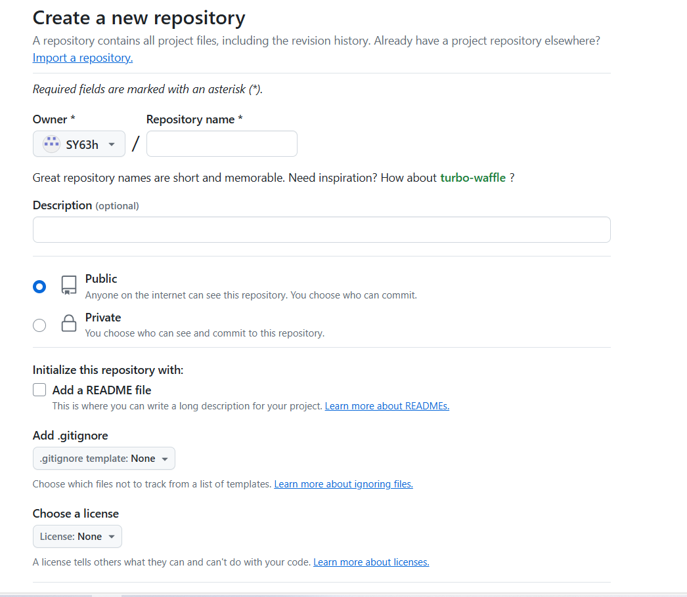

3、创建中心库

首先在桌面上创建github新工作区文件夹item，进入该文件夹后，右键找到git bash后点击进入命令行界面

输入命令：git init 进行初始化

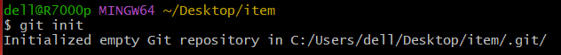

之后将在item文件夹里新建文件1.png

在命令行中输入：git status 查看工作区文件夹状态

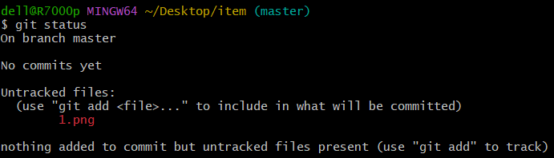

输入命令：git add 1.png 将文件添加到暂存区

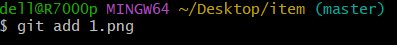

输入命令：git commit -m .将暂存区内容添加到版本库

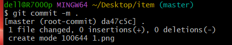

输入命令：git branch -M main 将当前分支重命名为main

输入以下命令：git remote add origin git@github.com:xcat-bug/LoveCN.git 连接仓库

输入命令ssh-keygen -t rsa -C "邮箱地址" 在该文件夹下创建ssh的公钥和私钥

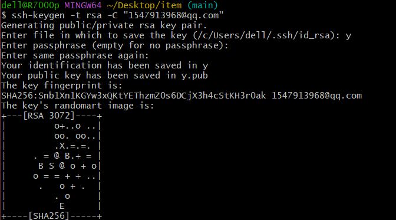

在个人主页中点击settings打开，点击SSH and GPG keys在右面界面将公钥添加到github中

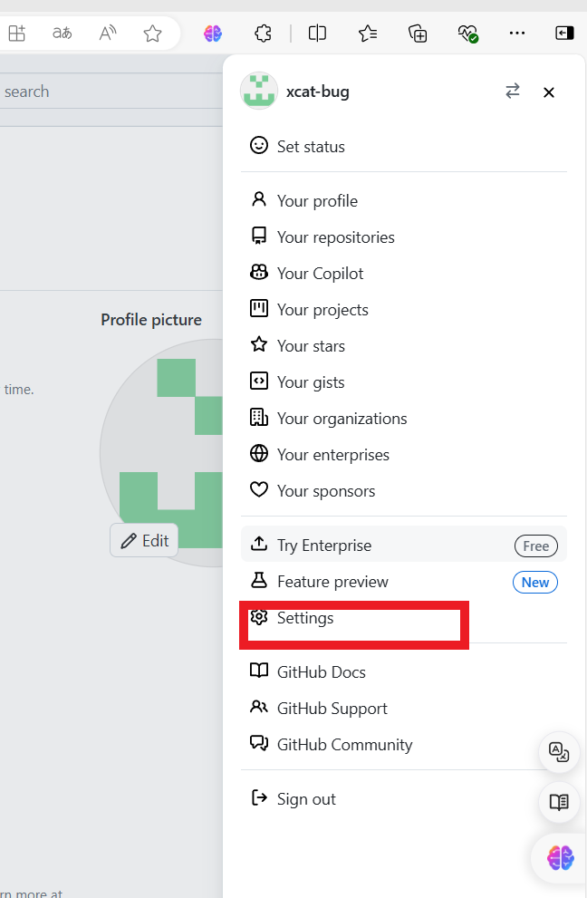

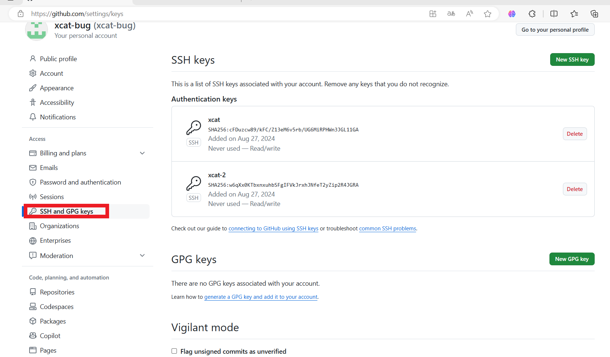

之后在命令行中输入：git push -u origin main 将内容传到github仓库上

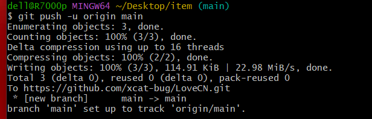

最后github上出现上传文件1.png说明上传成功

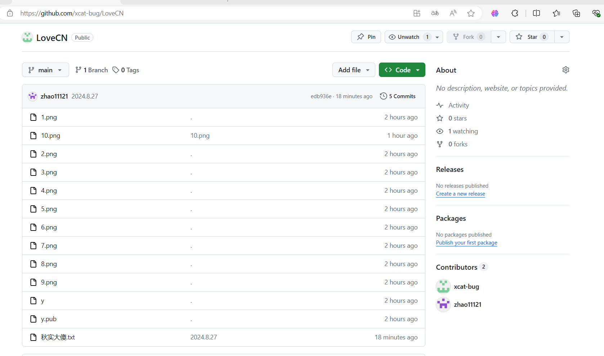

中心库创建成功

4、添加小组成员到组织里

   先点开创建的仓库选项栏点击最右边setting，然后选择collaborators，点击add people绿色按钮出现页面后输入其他组员的github账号或者邮箱。

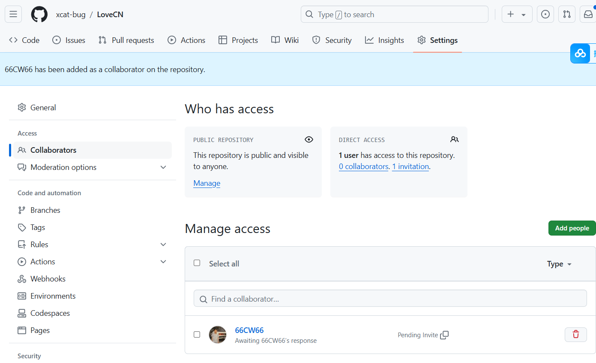

5、小组成员下载和上传文件

小组成员下载文件：小组成员创建新的文件，在该文件右键打开git bash 在命令行中输入：ssh-keygen -t rsa -C "邮箱地址" 在该文件夹下创建ssh的公钥和私钥，按之前添加公钥相同步骤将小组成员公钥添加

输入命令：git clone git@github.com:xcat-bug/LoveCN.git 将内容下载到小组成员新建的文件夹

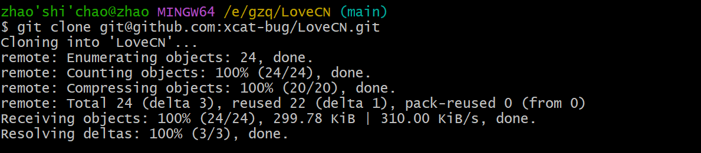

图片说明下载成功

小组成员上传文件：小组成员创建新的文件，创建新的文件abc.txt,之后在该文件右键打开git bash 在命令行中输入：git status 查看小组成员工作区的内容，发现新建文件abc.txt

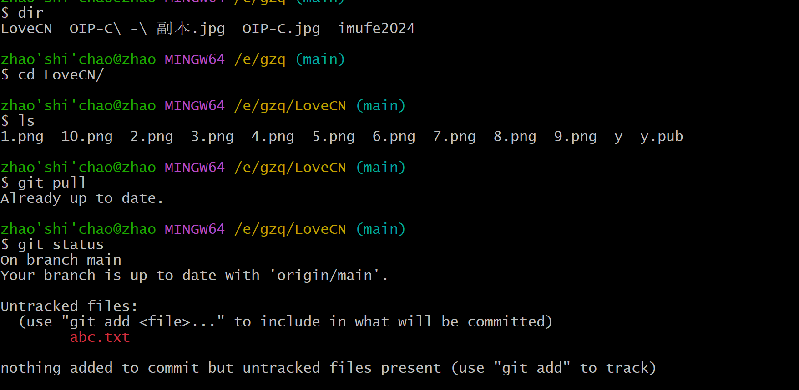

输入命令：git add . 将文件从小组成员工作区添加到暂存区

输入命令：git commit -m "0001" . 将暂存区内容上传到版本库

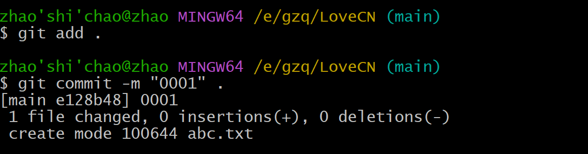

输入命令： git push将版本库内容上传到github仓库 

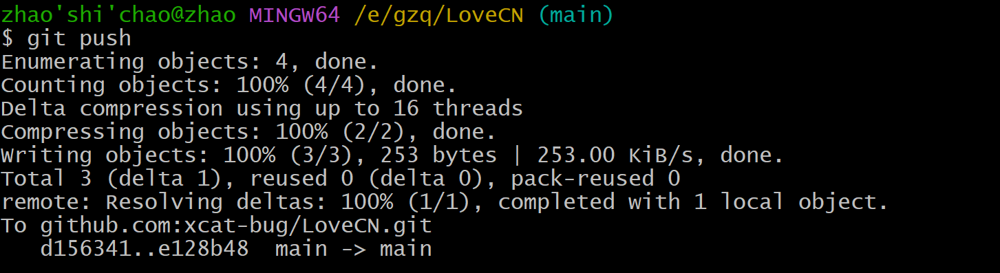

上传成功后 github中出现abc.txt文件夹

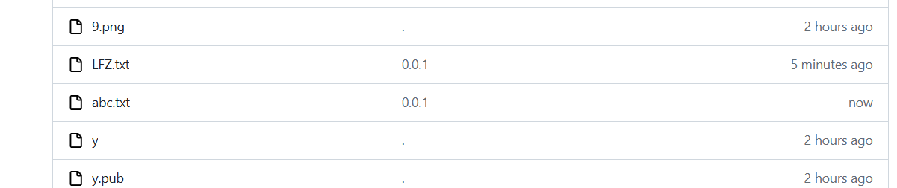

可见上传成功，实验完成

