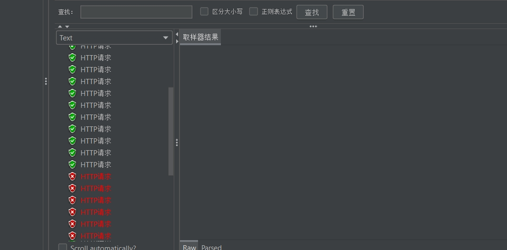

# 云平台设计及架构

### 实验拓扑：


1、linux系统下安装apache服务器


2、查看目录下文件


3、查看服务器状态


4、查看服务器ip地址


5、登录网页验证服务器是否正常运行


6、使用jmeter验证服务器状态


关闭服务器后查看jmeter结果：




7、使用qt编写控制端

主要代码：

```c++
void MainWindow::GetNetJson()
{
    QUrl url("http://192.168.178.53/data.json");
    NetAccessManager->get(QNetworkRequest(url));//获取成功 触发信号，调用对应的槽函数   ，  发送请求
}


void MainWindow::GetNetImgJson(QString url)
{
    ImgNetAccessManager->get(QNetworkRequest(url));//获取指定图片链接成功  则会调用   对应的槽函数
}
void MainWindow::onReplied(QNetworkReply *reply)
{

    qDebug()<<"发起网络请求";
    int satus_code = reply->attribute(QNetworkRequest::HttpStatusCodeAttribute).toInt();
    qDebug()<<"operation: "<<reply->operation();
    qDebug()<<"satus_code: "<<satus_code;
    qDebug()<<"url: "<<reply->url();
    qDebug()<<"raw header: "<<reply->rawHeaderList();
    if(reply->error() != QNetworkReply::NoError ||satus_code != 200 ){
        qDebug()<<reply->errorString().toLatin1().data();
        QMessageBox::warning(this,"QtNet","网络连接失败",QMessageBox::Ok);
    }else{
        QByteArray byteArray = reply->readAll();
        qDebug()<<"read all:" <<byteArray.data();

        //QPixmap Pixmap;
        //Pixmap.loadFromData(byteArray);
        fromNetJson(byteArray);  //处理解析获取到的JSON数据
    }
    reply->deleteLater();
}

/*
{
    "error":0,
    "result":200,
    "img":"//v.api.aa1.cn/api/api-gqsh/img/305.jpg"
}
*/
//将imgurl 存储成员变量中
void MainWindow::fromNetJson(QByteArray &byteArr)
{
    QJsonDocument doc = QJsonDocument::fromJson(byteArr.data());//将返回的字符串转换为对象
    if(!doc.isArray()){ // 检查是否为数组
        qDebug()<<"拿到的数据不是一个 jsonArray!";
        return;
    }
    QJsonArray jsonArray = doc.array(); // 获取 JSON 数组
    if (jsonArray.isEmpty()) {
        qDebug()<<"jsonArray is empty!";
        return;
    }
    QJsonValue objVal = jsonArray.at(0); // 使用 at() 访问数组第一个元素
    if (!objVal.isObject()) {
        qDebug()<<"第一个元素不是一个 jsonObject!";
        return;
    }
    QJsonObject obj = objVal.toObject(); // 转换为数组中的第一个对象
    ImgUrl = obj.value("url").toString(); // 获取其中的图片地址并赋值给成员变量
    qDebug()<< "ImgUrl:" <<ImgUrl;
    GetNetImgJson(ImgUrl); // 根据返回的图片地址获取图片
}


```

结果输出：


8、可视化界面实现

主要代码：

```vue
<template>
  <div>
    <h2>从服务器获取 JSON 数据</h2>
    <div v-if="loading">加载中...</div>
    <div v-if="error">{{ error }}</div>
    <div v-else-if="jsonData">
      <pre>{{ jsonData }}</pre> 
    </div>
  </div>
</template>

<script setup>
import { ref, onMounted } from 'vue';
import axios from 'axios';

const jsonData = ref(null);
const loading = ref(true);   // 加载状态
const error = ref('');       // 错误信息

// 函数：抓取数据
const fetchData = async () => {
  try {
    // 从服务器获取 JSON 数据
    const response = await axios.get('http://192.168.178.53/data.json');
    jsonData.value = response.data; // 将数据存储在 jsonData 中
  } catch (err) {
    console.error('Fetch Error:', err); // 输出错误到控制台
    error.value = '无法加载数据: ' + (err.response ? err.response.data : err.message); // 设置错误信息
  } finally {
    loading.value = false; // 设置加载状态为 false
  }
};

onMounted(fetchData);
</script>

<style scoped>

</style>

```

运行：

出现的问题：network error


起初认为连接不同网络导致网段不同为原因，后经查实不为原因。