一、创建组

创建四个组分别为All组（代表整个公司），Market组（代表市场组），RD组（代表研发组），Logistics组（后勤组）。

使用命令：

```
groupadd ALL;groupadd Market;groupadd RD;groupadd Logistics
```

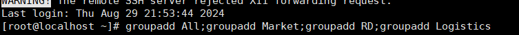

通过以下命令可以查询到对应组id：

```
cat /etc/group
```

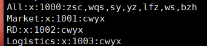

可以得出ALL组id为1000，Market组id为1001，RD组id为1002，Logistics组id为1003

二、创建用户

分别创建用户加入到对应组 cwyx（uid=1000)为老板主组为All(gid=1000)组，附属组为市场组(gid=1001)、研发组(gid=1002)和后勤组(gid=1003),zsc(uid=1001)，wqs(uid1002)主组为研发组，附属组为All组，yz(uid=1004)，lfz(uid=1005)主组为市场组，附属组为All组，ws(uid=1006)，bzh(uid=1007)，sy(uid=1003)主组为后勤组，附属组为ALL组

使用以下命令创建：

```
useradd -g 1000 -G 1001,1002,1003 cwyx; useradd -g 1002 -G 1000 zsc; useradd -g 1002 -G 1000 wqs; useradd -g 1003 -G 1000 sy; useradd -g 1001 -G  1000 yz; useradd -g 1001 -G 1000 lfz; useradd -g 1003 -G 1000 ws; useradd -g 1003 -G 1000 bzh
```


使用以下命令查看分组情况：

```
cat /etc/passwd
```

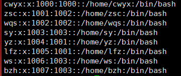

三、分配权限

1、设置umask为207 （r-xrwx---）

```
使用命令 umask 007   <!--设置默认权限为r-xrwx--- -->
```

2、建立各个组的相应目录

使用命令

```
mkdir  RDFile      <!--建立RDFile文件夹-->

mkdir marketFile  <!--建立marketFile文件夹-->

mkdir logisticsFile   <!--建立logisticsFile文件夹-->
```

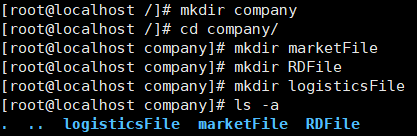

3、查看权限

使用命令ll 

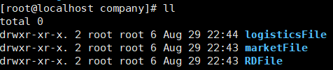

4、最终设置

All组对属主（cwyx）权限为rwx，对属组（除cwyx所有人）权限为r-x，对其他组权限为---

Market组对属主（cwyx）权限为rwx，对属组（yz，lfz）权限为rwx，对其他组权限为---

RD组对属主（cwyx）权限为rwx，对属组（wqs，zsc）权限为rwx，对其他组权限为---

Logistics组对属主（cwyx）权限为rwx，对属组（bzh，sy，ws）权限为rwx，对其他组权限为---

使用命令：

```
chown cwyx:logistics logisticsFile/      <!--修改logisticsFile文件所属主为cwyx，所属组为logistics-->

chown cwyx:Market marketFile/ <!--修改marketFile文件所属主为cwyx，所属组为Market-->

chown cwyx:RD RDFile/ <!--修改RDfile文件所属主为cwyx，所属组为RD-->
```

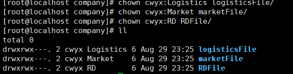

建立各个组的用户

5、建立各组用户的工作文件并设置文件的属主及属组

首先设置默认权限

使用命令

```
 umask 026
```

 

建立txt文件为各个用户的工作文件

除了使用umask命令进行当前会话的用户默认权限设置外，我们还可以对该用户永久性修改umask值。针对某个用户修改，需要用该用户登录Linux，然后修改/etc/profile文件中的umask值。

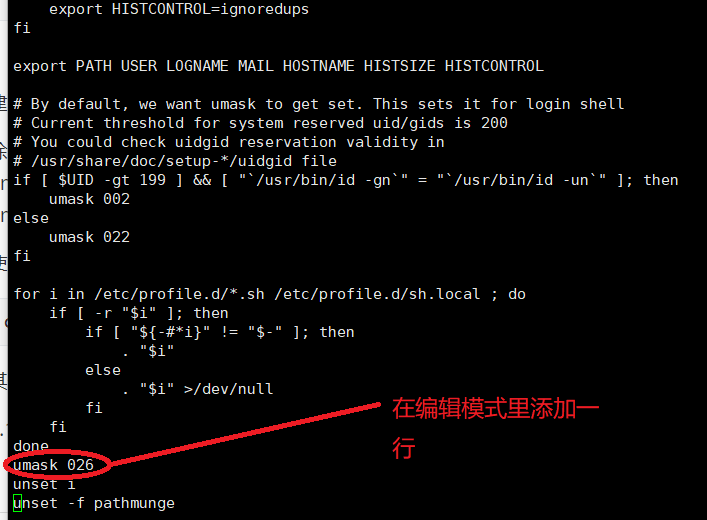

使用命令：

```
chown lfz:Market lfz.txt <!--设置lfz.txt文件的属主lfz以及属组Market-->
```

其他属主和属组更改同上命令

5.1、market组：

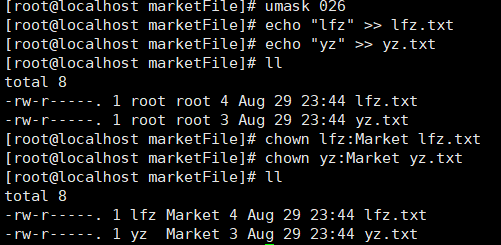

上图market组两个成员文件建立，权限与设置的默认权限相同，说明设置成功

5.2、RD组：

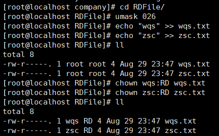

上图RD组两个成员文件建立，权限与设置的默认权限相同，说明设置成功


5.3、logistics组：

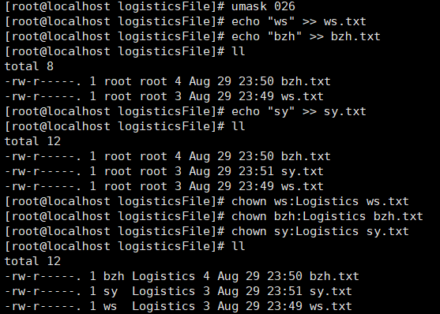

上图Logistics组两个成员文件建立，权限与设置的默认权限相同，说明设置成功4

四、验证用户权限

1、验证cwyx（uid=1000 老板）的权限：
打开一个新的终端，登录用户名为cwyx（老板）的用户

在根目录下，使用命令：

```
cd company/ 
```

进入company目录并验证用户cwyx对目录conpany的读和执行权限

使用命令

```
 echo "laoban" >> laobantest.txt 
```

验证老板在company目录下的写入权限

进入RDFile目录可以验证用户cwyx对该目录由读和执行权限

使用命令

```
echo "Project requirements" >> PR.txt
```

验证 验证老板在RDfile目录下的写入权限


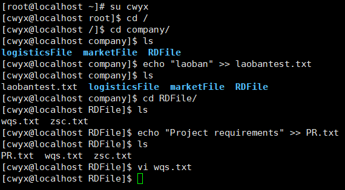

使用命令：

```
vi wqs.txt 
```

可以验证cwyx对该文件仅有读权限


cwyx（老板）对于目录 logisticsFile和marketFile的验证方式同上

2、验证在ALL组内除cwyx外任意用户的权限

打开一个新的终端，登录用户名为wqs（uid=1002）的用户

在根目录下，使用命令：

```
cd company/ 
```

进入company目录并验证用户wqs对目录conpany的读和执行权限

使用命令：

```
vi laobantest.txt
```

 验证wqs用户对company目录下的文件只有读权限

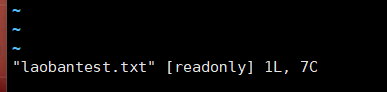

使用命令 ：

```
mkdir xcat 
```

验证wqs在company目录下的没有写入权限

使用命令：

```
cd maketFile/;cd logisticsFile/ 
```

验证wqs用户对于这两个目录没有渡河执行权限

进入RDFile目录可以验证用户wqs对该目录有读和执行权限

使用命令：

```
vi PR.txt 
```

验证wqs用户对于属主不是自己的文件只有可读权限


使用命令：

```
vi wqs.txt
```

 验证wqs用户对于属主是自己的文件有读写权限


在ALL组内除cwyx和wqs外其他用户的测试方式同上

3、验证ALL组外的其他用户的权限

在根目录下 输入命令

```
cd company/
```

验证发现其他用户对company目录没有任何权限


