**作业要求：**
Windows2003操作系统中模拟公司建组。建立8个用户分别为ABCDEFGH，H为老板，建立四个组，分别为市场组、研发组、后期组、公司组。ABH在市场组，CDH在研发组，EFGH在后勤组，ABCDEFGH在公司组。每个组的用户具有对自己文件读写执行权限，对同组其他人只能有读权限。不同组的人不可以互相进入。

**设计思路：**
先创建8个用户，再创建4个组，然后在每个组中添加对应的用户。做好以上基础工作后，开始分配权限，最后测试进行最终验证。只允许本部门成员访问。

1、鼠标右键我的电脑打开管理

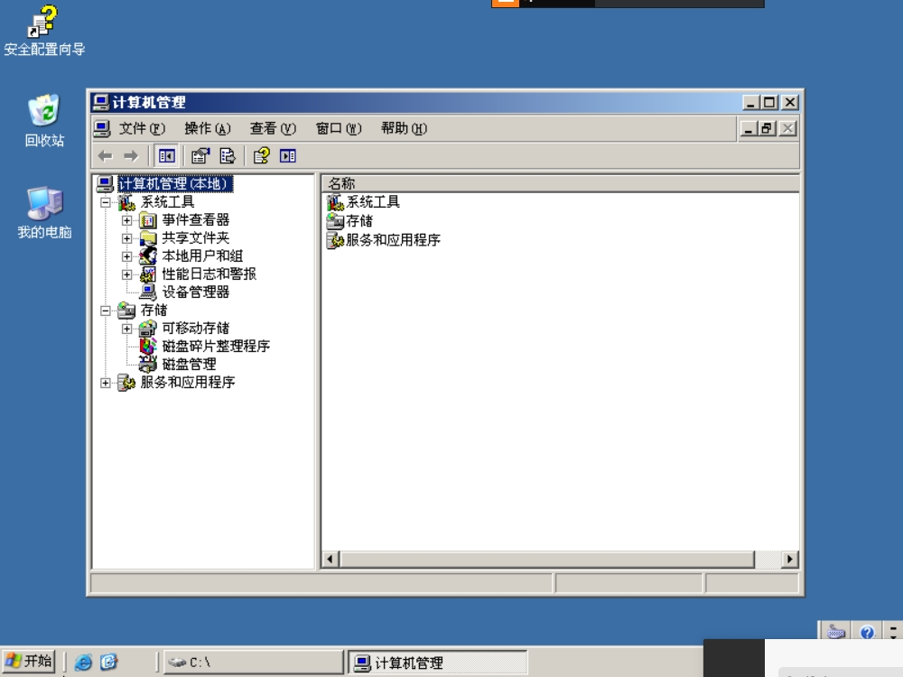

2、在打开界面找到本地用户和组，右键点击新用户添加用户（老板为cwyx）

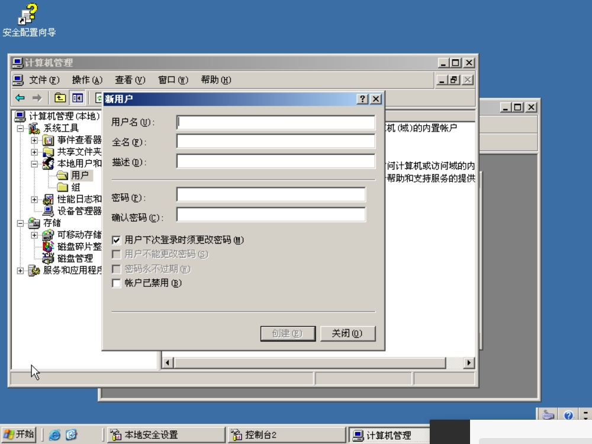

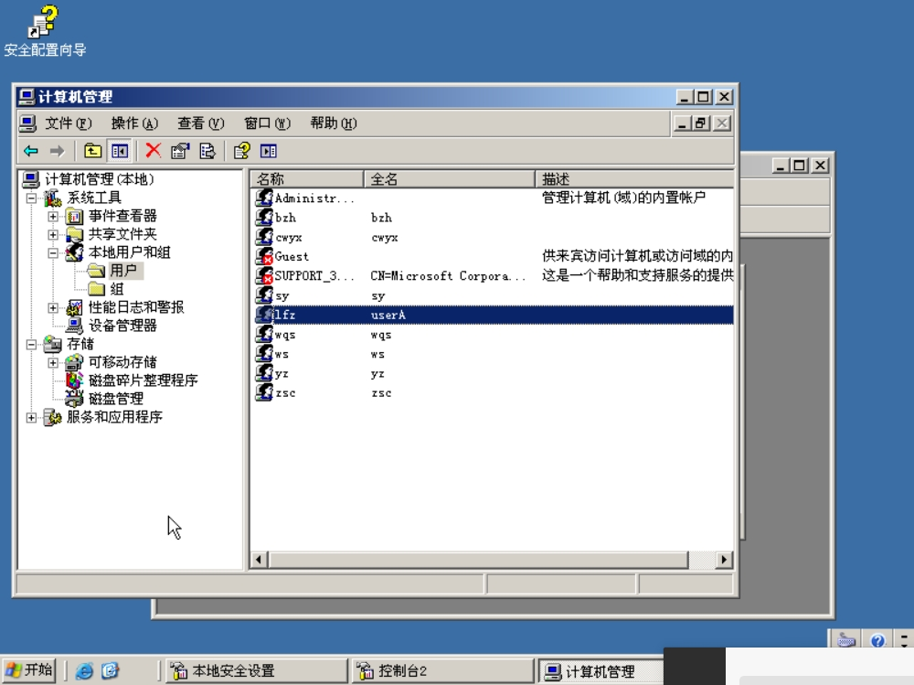

3、打开组文件夹，右键点击新建组建立all（所有人），market（yz，cwyx、lfz），develop（cwyx、wqs、zsc），log（bzh、cwyx、sy、ws）组

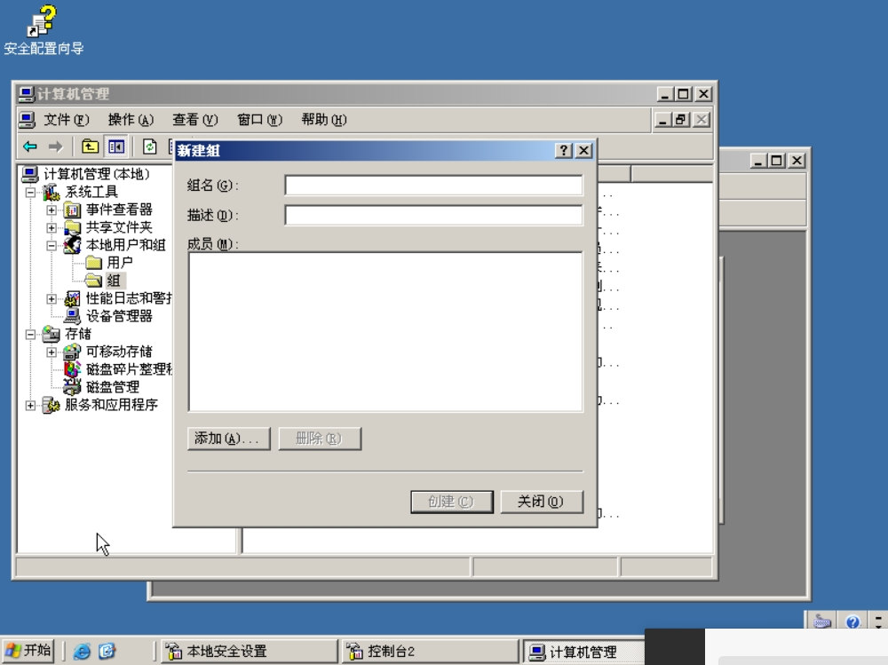

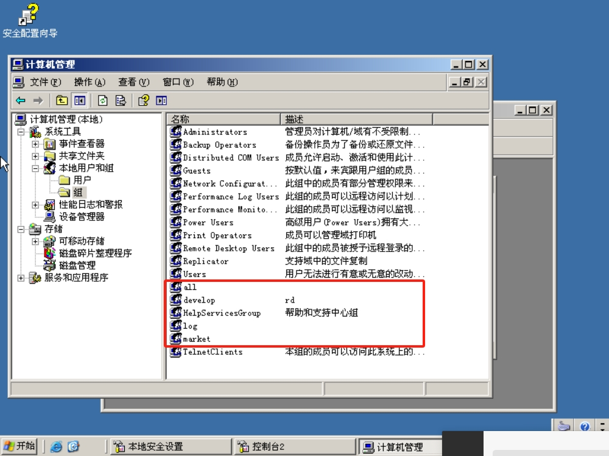

4、在公用文件夹下（例如c盘下）建立工作文件夹job，在文件夹下分别建立all、develop、log、market文件夹作为组的文件夹

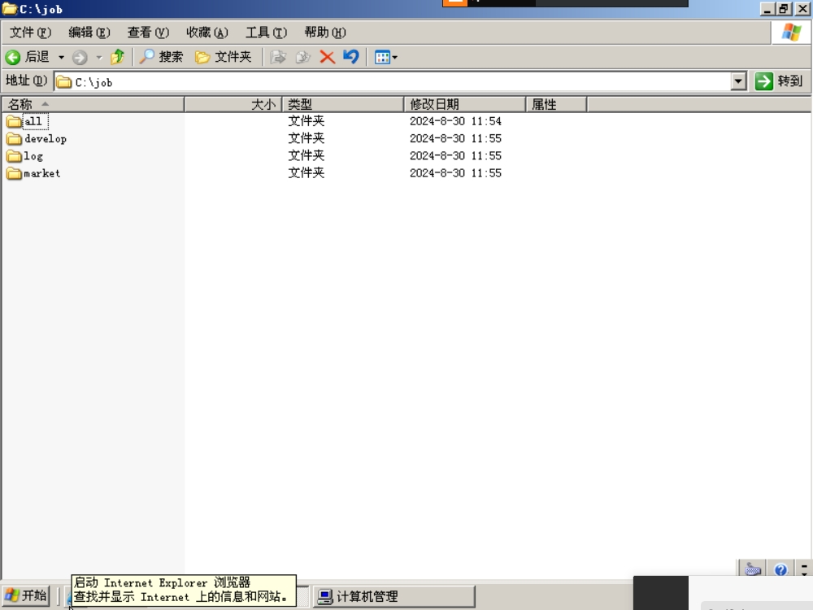

5、为了防止windows自带的users组干扰权限，右键文件夹打开属性找到安全打开高级选项，去掉允许父项的继承权限传播到该对象等选项的勾。

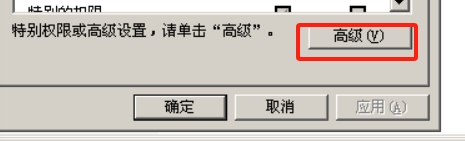

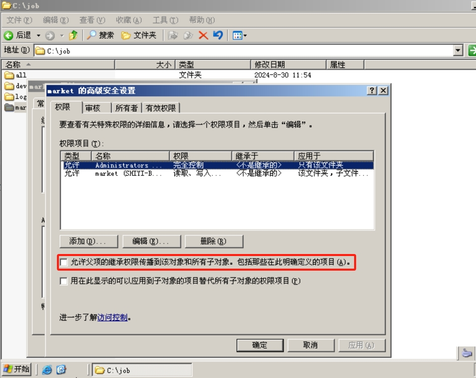

6、设置每个组的文件夹的权限。例如market：market全体成员拥有读和写的权限，老板cwyx独立再添加进入并拒绝作为market组的写权限

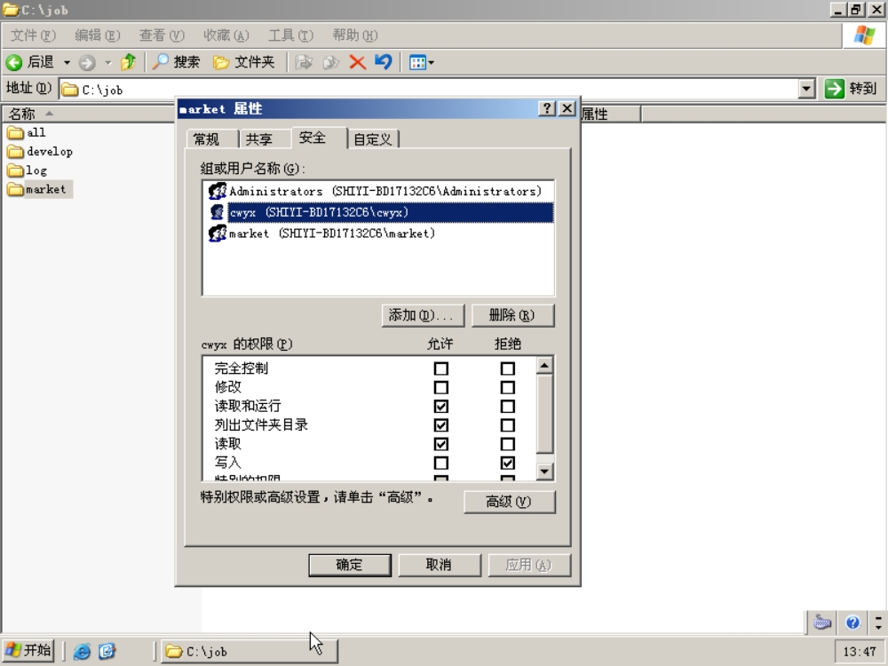

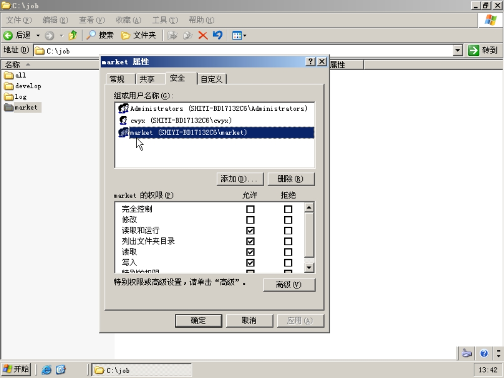

**验证结果**

登录cwyx（老板）账号，查看结果可以在all文件夹读写，在其它文件夹可以读，但不可以写

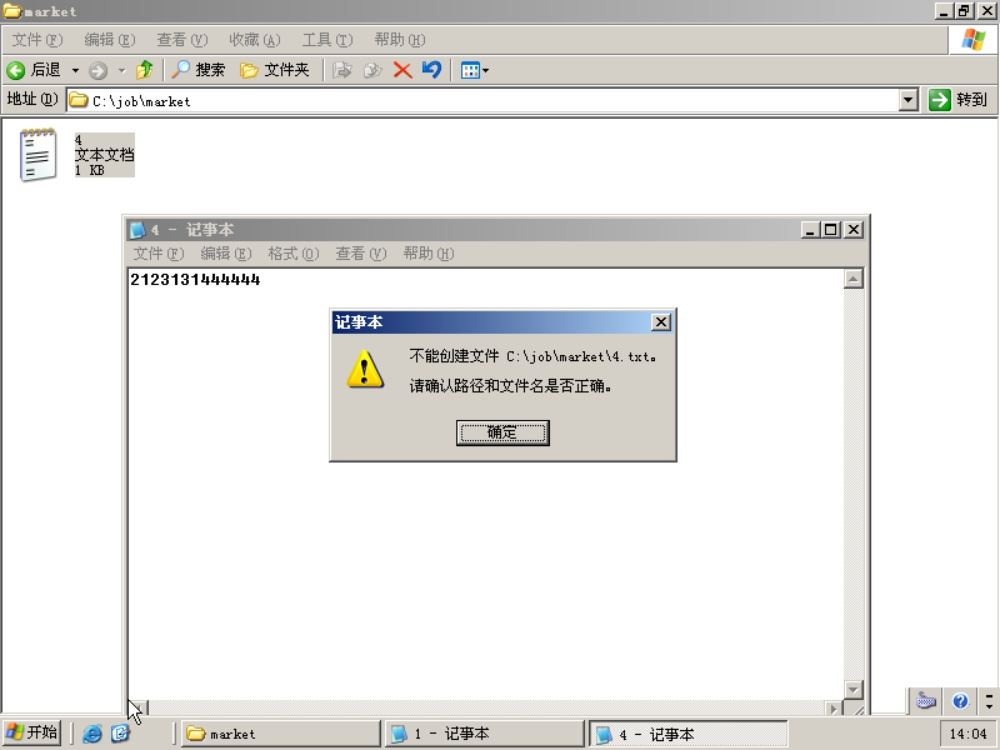

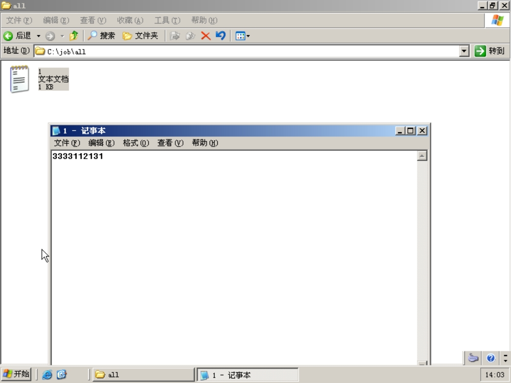

登录组员账号（例如yz，属于market文件夹），查看结果，在all文件夹下可以读写，market文件夹可以读写，其它文件夹不可以访问。

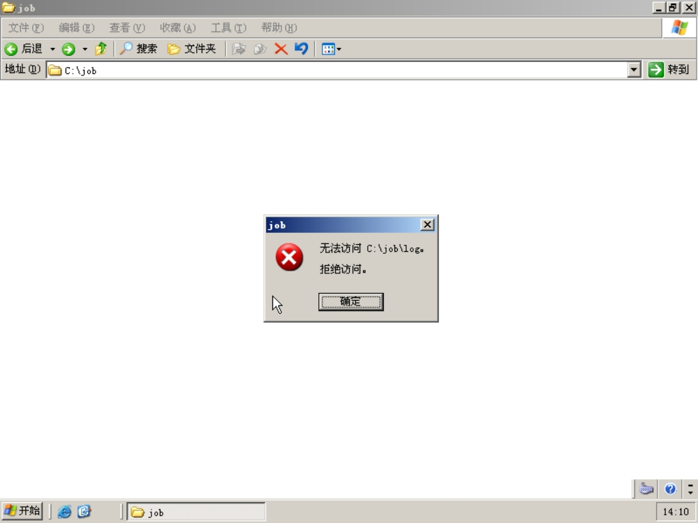

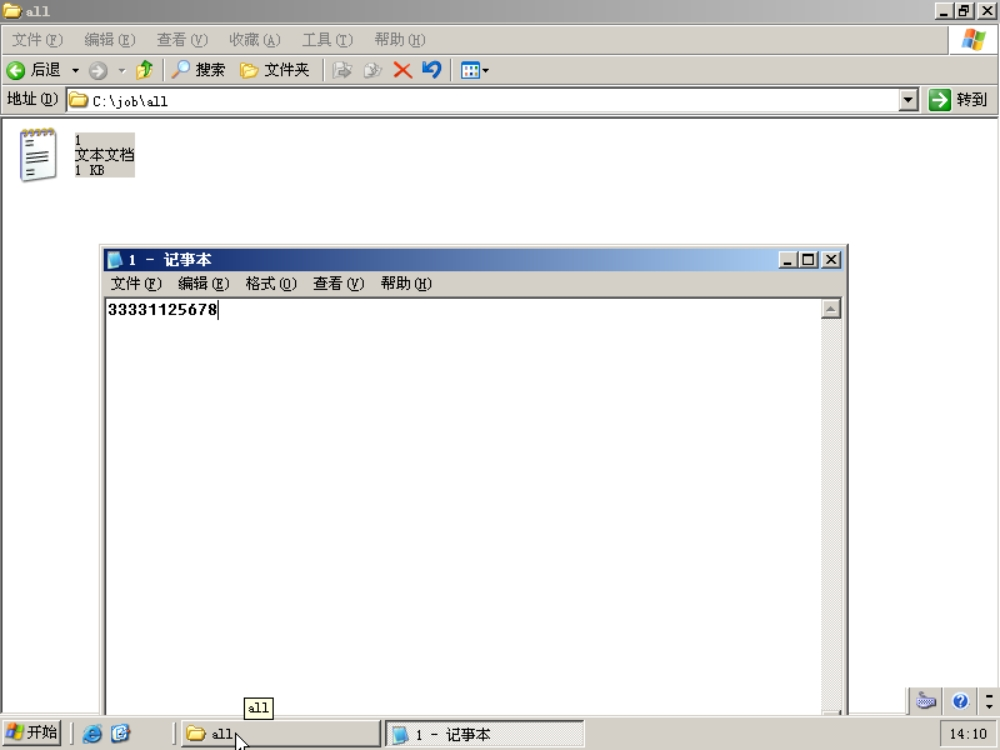