# 邮件服务的搭建及防火墙的配置

实验拓扑：

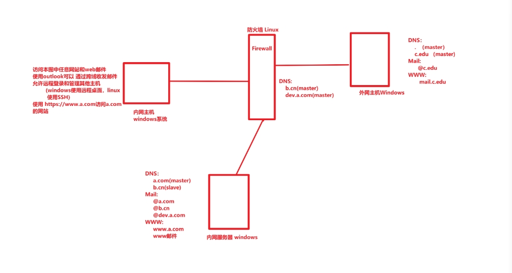

### 配置网卡：

新建一个名为firewall的linux主机作为防火墙并添加三块网卡，分别为ens33，ens36，ens37.并配置静态IP地址分别为192.168.100.128（ens33），172.16.100.128（ens36），10.16.100.128（ens37）。

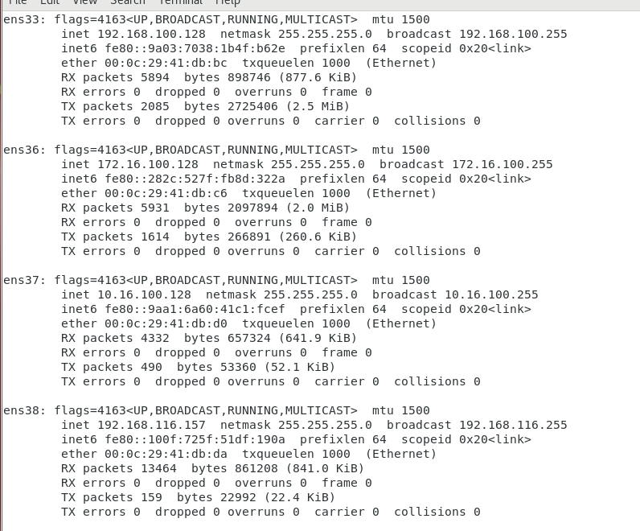

新建一个名为inner的windows主机作为内网，设置ip地址为192.168.100.129。服务器指定为（dmz）172.16.100.129。

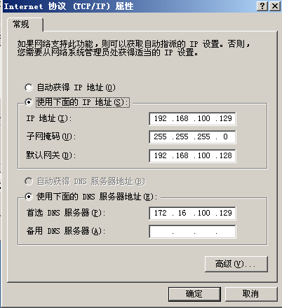

新建一个名为dmz的windows主机作为服务器，设置IP地址为172.16.100.129。

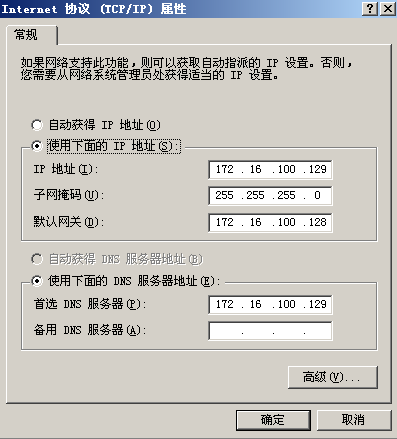

新建一个名为outer的windows主机作为外网，设置IP地址为10.16.100.129。

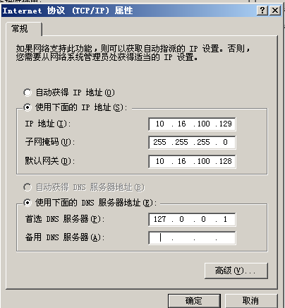

配置路由后四个主机实现通信：

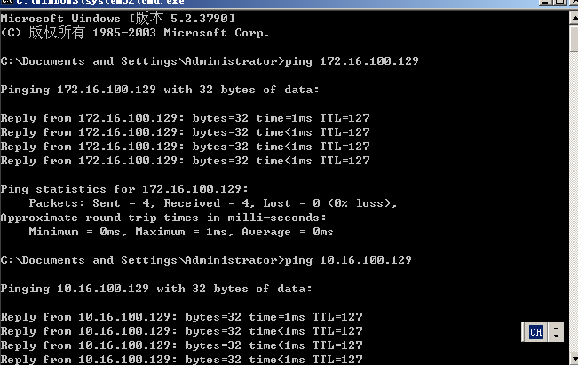


### 配置邮件交换服务：

##### dmz配置

在IIS添加网站，如下图：

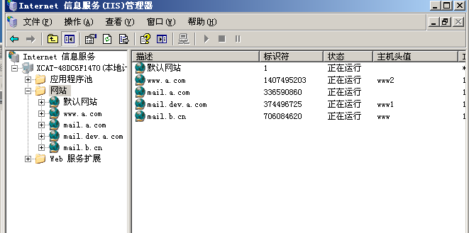

配置DNS服务，将a.com作为主要区域，委派dev.a.com到主机firewall中，设置b.cn辅助区域，复制firewall中b.cn区域，具体配置如下：

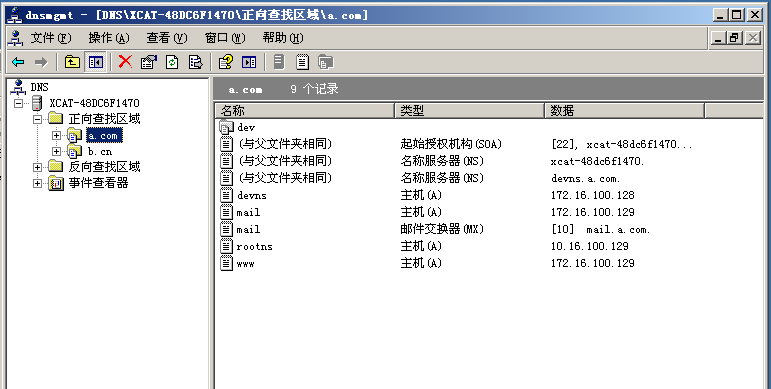

##### firewall的配置

添加b.cn，dev.a.com区域，设置相应配置文件名为b.cn.zone,dev.a.com.zone

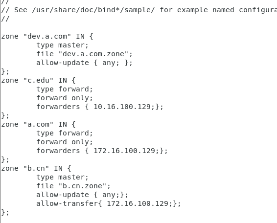

编辑文件b.cn.zone

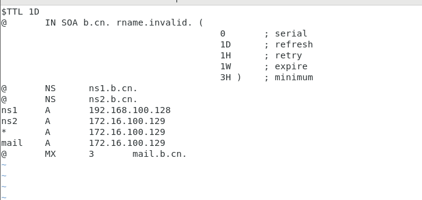

编辑文件dev.a.com.zone

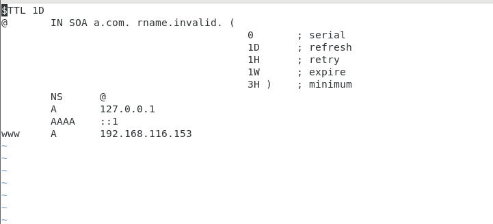

修改named.ca 文件，将根目录映射至outer主机，其余的根全部注释。

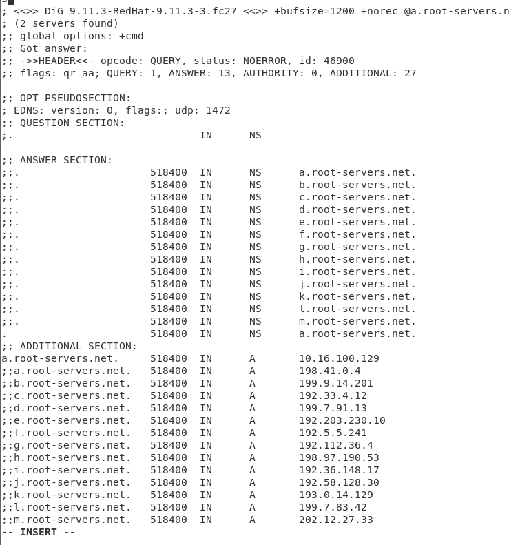

重启服务

```shell
systemctl restart named
```

刷新dmz辅助区域b.cn

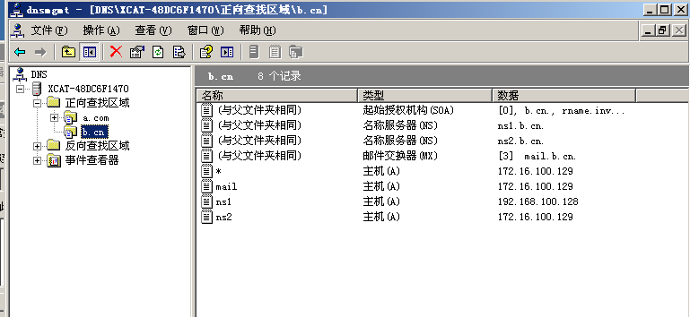

##### outer配置

outer配置c.edu为主要区域，配置根目录"."根目录委派a.com,b.cn,c.edu。

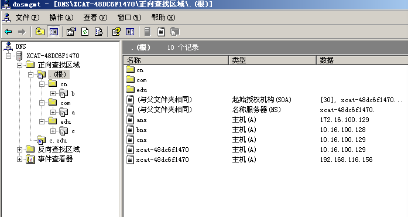

##### 验证

在inner主机中通过nslookup验证可以解析到mail.a.com,dev.a.com,b.cn以及c.edu

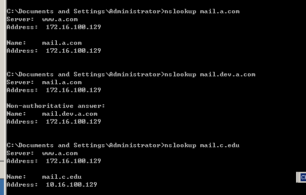

在dmz中添加域名及用户后，成功实现接发邮件的操作。

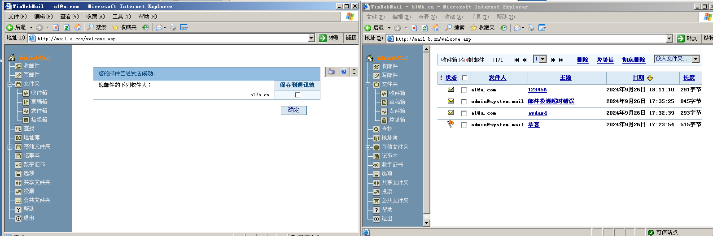

其余验证的邮件转发同上。

### 防火墙规则配置

编写脚本

初始化iptables规则，将默认规则删除

```bash
#!/bin/bash
aServerPorts="25 53 80 110 143 443 3389"
iptables -t filter -F
iptables -t nat -F
iptables -t filter -X
iptables -t nat -X
iptables -t filter -Z
iptables -t nat -Z

```

将所有接收到的包全部扔掉。

```bash
iptables -t filter -P INPUT DROP
iptables -t filter -P OUTPUT DROP
iptables -t filter -P FORWARD DROP
```


```bash
iptables -t filter -A INPUT -s localhost -d localhost -j ACCEPT
iptables -t filter -I OUTPUT -s localhost -d localhost -j ACCEPT
#允许所有来自本地主机的输入和输出流量
iptables -t filter -A INPUT -i ens33 -p tcp -s 192.168.100.129 --dport 80 -m state --state NEW,ESTABLISHED -j ACCEPT
iptables -t filter -A OUTPUT -o ens33 -p tcp -d 192.168.100.129 --sport 80 -m state --state NEW,ESTABLISHED -j ACCEPT
#允许来自 IP 地址 192.168.100.129 的 TCP 流量通过接口 ens33 访问指定的 HTTP 服务（80 端口），并且允许服务器回复这些请求。
iptables -t filter -A INPUT -i ens33 -p tcp -s 192.168.100.129 --dport 53 -m state --state NEW,ESTABLISHED -j ACCEPT
iptables -t filter -A OUTPUT -o ens33 -p tcp -d 192.168.100.129 --sport 53 -m state --state NEW,ESTABLISHED -j ACCEPT
iptables -t filter -A INPUT -i ens33 -p udp -s 192.168.100.129 --dport 53 -m state --state NEW,ESTABLISHED -j ACCEPT
iptables -t filter -A OUTPUT -o ens33 -p udp -d 192.168.100.129 --sport 53 -m state --state NEW,ESTABLISHED -j ACCEPT
iptables -t filter -A INPUT -i ens33 -p icmp -s 192.168.100.129  -j ACCEPT
iptables -t filter -A OUTPUT -o ens33 -p icmp -d 192.168.100.129 -j ACCEPT
iptables -t filter -A INPUT -i ens36 -p icmp -s 172.16.100.129 -j ACCEPT
iptables -t filter -A OUTPUT -o ens36 -p icmp -d 172.16.100.129 -j ACCEPT
iptables -t filter -A INPUT -i ens37 -p icmp -s 10.16.100.129 -j ACCEPT
iptables -t filter -A OUTPUT -o ens37 -p icmp -d 10.16.100.129 -j ACCEPT

```

允许主机inner到outer的80、3389、25、110、143端口通信。配置规则如下：

```bash
#inner to outer
iptables -A FORWARD -i ens33 -o ens37 -p tcp -s 192.168.100.129 -d 10.16.100.129 --dport 80 -j ACCEPT
iptables -A FORWARD -i ens37 -o ens33 -p tcp -s 10.16.100.129 -d 192.168.100.129 --sport 80 -j ACCEPT
iptables -A FORWARD -i ens33 -o ens37 -p icmp -s 192.168.100.129 -d 10.16.100.129 -j ACCEPT
iptables -A FORWARD -i ens37 -o ens33 -p icmp -s 10.16.100.129 -d 192.168.100.129 --icmp-type 0 -j ACCEPT
iptables -A FORWARD -i ens33 -o ens37 -p tcp -s 192.168.100.129 -d 10.16.100.129 --dport 3389 -j ACCEPT
iptables -A FORWARD -i ens37 -o ens33 -p tcp -s 10.16.100.129 -d 192.168.100.129 --sport 3389 -j ACCEPT
iptables -A FORWARD -i ens33 -o ens37 -p tcp -s 192.168.100.129 -d 10.16.100.129 --dport 25 -j ACCEPT
iptables -A FORWARD -i ens37 -o ens33 -p tcp -s 10.16.100.129 -d 192.168.100.129 --sport 25 -j ACCEPT
iptables -A FORWARD -i ens33 -o ens37 -p tcp -s 192.168.100.129 -d 10.16.100.129 --dport 110 -j ACCEPT
iptables -A FORWARD -i ens37 -o ens33 -p tcp -s 10.16.100.129 -d 192.168.100.129 --sport 110 -j ACCEPT
iptables -A FORWARD -i ens33 -o ens37 -p tcp -s 192.168.100.129 -d 10.16.100.129 --dport 143 -j ACCEPT
iptables -A FORWARD -i ens37 -o ens33 -p tcp -s 10.16.100.129 -d 192.168.100.129 --sport 143 -j ACCEPT
```

inner到dmz配置如下：

```bash
#inner to dmz
iptables -A FORWARD -i ens33 -o ens36 -j ACCEPT
```

dmz到inner配置如下

```bash
#dmz to inner
iptables -A FORWARD -i ens36 -o ens33 -p udp --sport 53 -j ACCEPT
iptables -A FORWARD -i ens36 -o ens33 -p icmp --icmp-type 0 -j ACCEPT
for aServerPort in $aServerPorts
do
        iptables -A FORWARD -i ens36 -o ens33 -p tcp --sport $aServerPort -j ACCEPT
done
```

dmz到outer配置如下：

```bash
#dmz to outer
iptables -A FORWARD -i ens36 -o ens37 -p udp -s 172.16.100.129 -d 10.16.100.129 --dport 53 -j ACCEPT
iptables -A FORWARD -i ens37 -o ens36 -p udp -s 10.16.100.129 -d 172.16.100.129 --sport 53 -j ACCEPT
iptables -A FORWARD -i ens36 -o ens37 -p tcp -s 172.16.100.129 -d 10.16.100.129 --dport 53 -j ACCEPT
iptables -A FORWARD -i ens37 -o ens36 -p tcp -s 10.16.100.129 -d 172.16.100.129 --sport 53 -j ACCEPT
iptables -A FORWARD -i ens36 -o ens37 -p tcp -s 172.16.100.129 -d 10.16.100.129 --dport 80 -j ACCEPT
iptables -A FORWARD -i ens37 -o ens36 -p tcp -s 10.16.100.129 -d 172.16.100.129 --sport 80 -j ACCEPT
iptables -A FORWARD -i ens36 -o ens37 -p icmp -s 172.16.100.129 -d 10.16.100.129 -j ACCEPT
iptables -A FORWARD -i ens37 -o ens36 -p icmp --icmp-type 0 -s 10.16.100.129 -d 172.16.100.129 -j ACCEPT

```

防火墙到dmz配置如下：

```bash
#firewall to dmz
iptables -t filter -A INPUT -p tcp  -s 172.16.100.129 --dport 53 -j ACCEPT
iptables -t filter -A OUTPUT -p tcp  --sport 53 -d 172.16.100.129 -j ACCEPT
iptables -t filter -A INPUT -p udp  -s 172.16.100.129 --dport 53 -j ACCEPT
iptables -t filter -A OUTPUT -p udp  --sport 53 -d 172.16.100.129 -j ACCEPT
iptables -t filter -A INPUT -p tcp  -s 172.16.100.129 --dport 80 -j ACCEPT
iptables -t filter -A OUTPUT -p tcp  --sport 80 -d 172.16.100.129 -j ACCEPT
```

验证：

运行该脚本丢掉所有包后inner无法显示网页

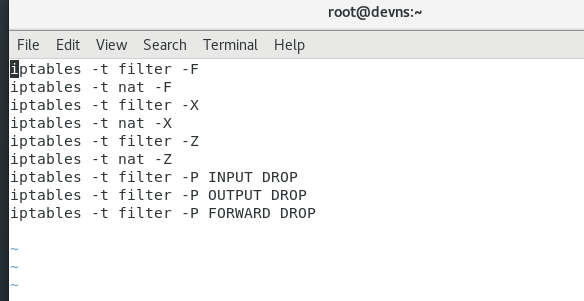

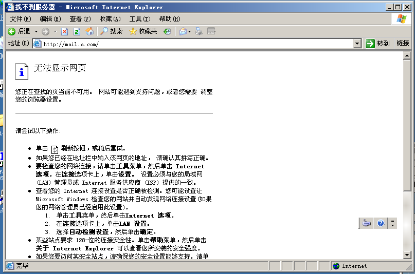

无法ping通

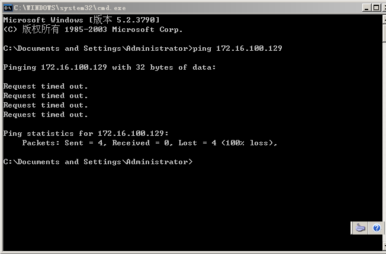

添加如上规则后验证可以ping通172.16.100.129

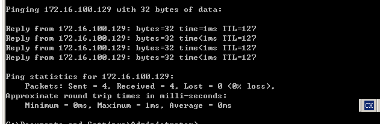

可以访问mail.a.com


可以访问b.cn

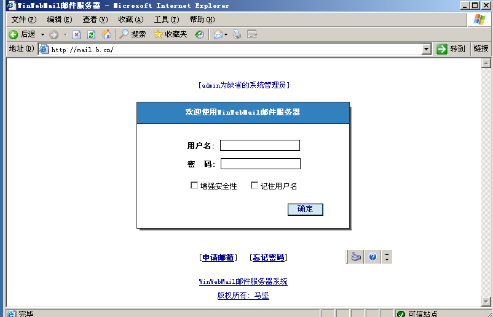

可以访问c.edu

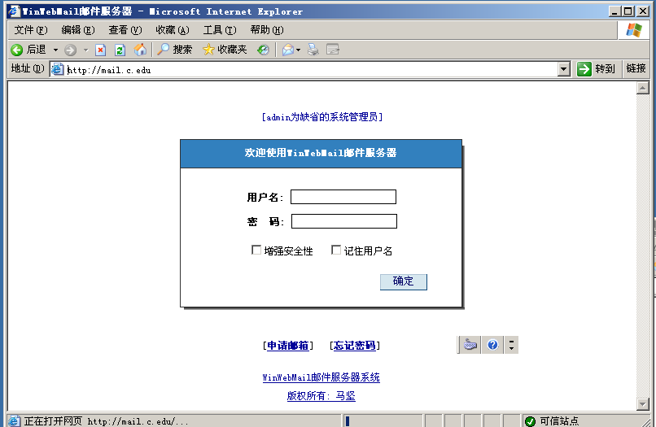

可以ping通

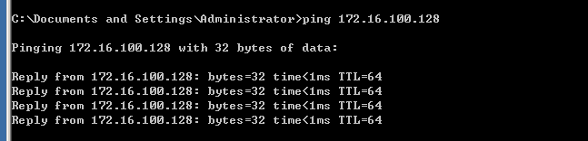

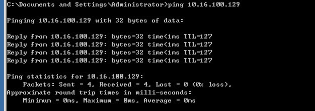

内网远程桌面可以与外网建立连接

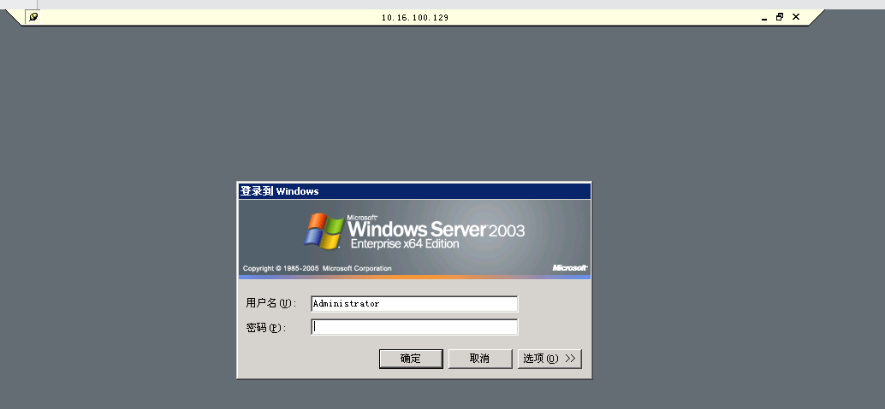

但外网远程桌面不可以与内网建立连接

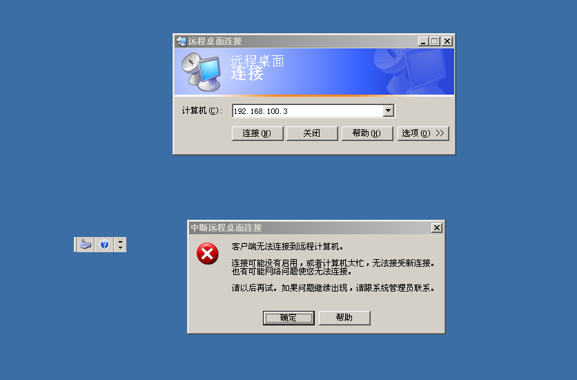

内网远程桌面可以与dmz区域建立连接

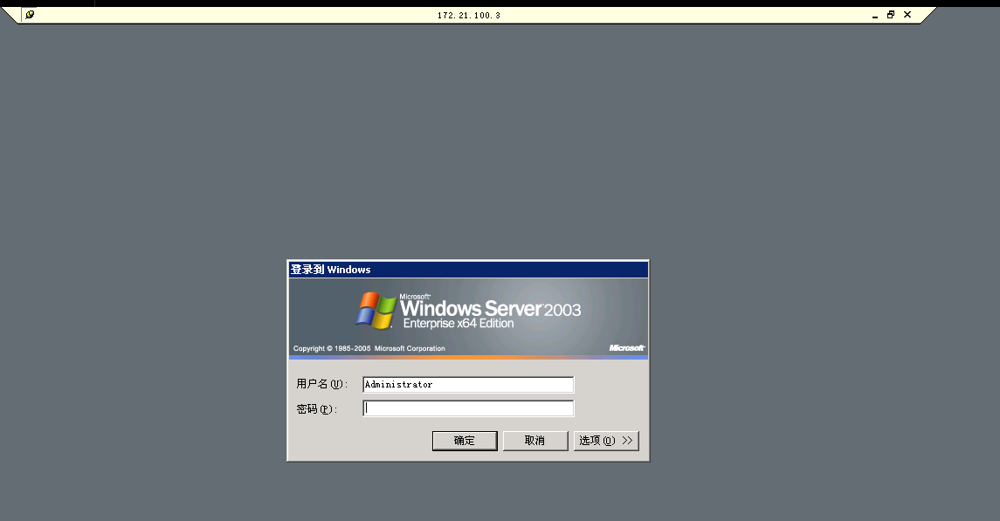

但dmz远程桌面不可以与内网建立连接

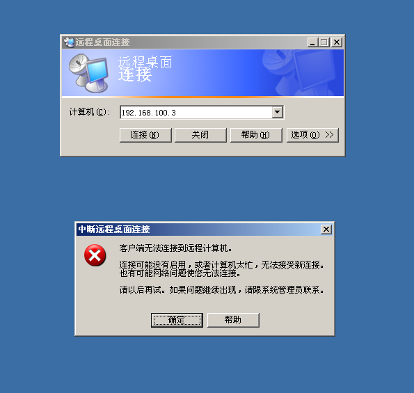

wqs@a.com用户登录到mail.a.com邮件页面，发送邮件给用户a1@a.com.

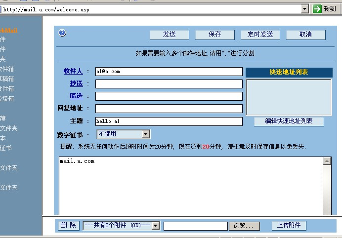


用户a1登录到mail.a.com，接收到

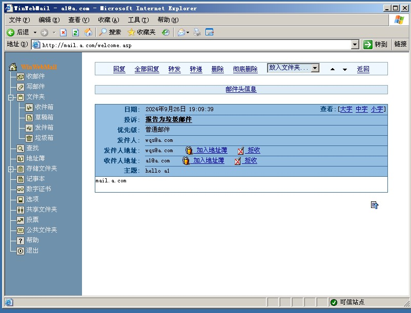

wqs@b.cn用户登录到mail.b.cn邮件页面，发送邮件给用户b1@b.cn.

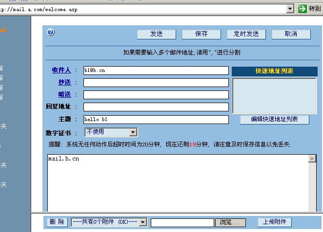

用户b1登录到mail.b.cn，接收到

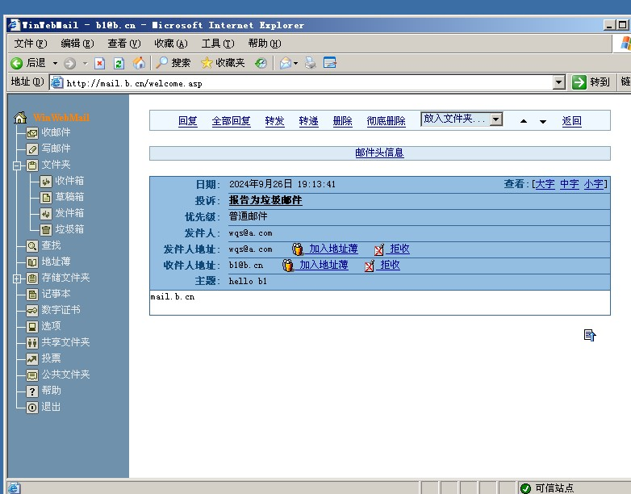

wqs@dev.a.com用户登录到mail.dev.a.com邮件界面，发送邮件给用户de@dev.com.

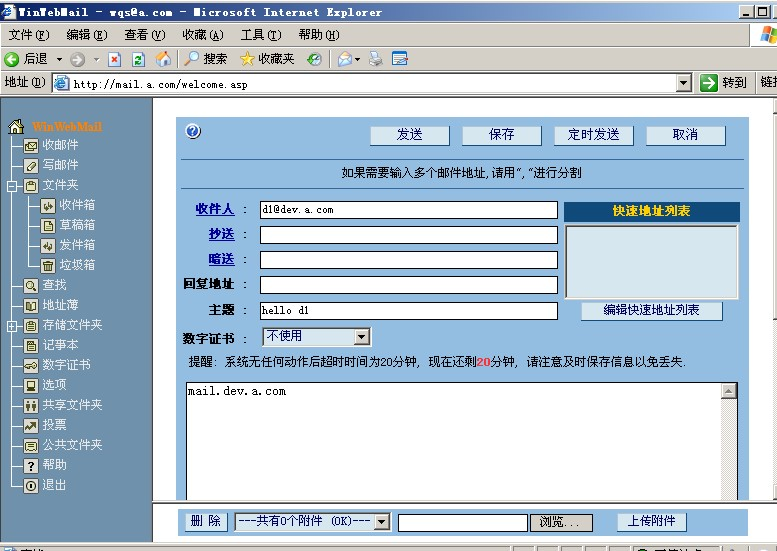

用户de登录到mail.dev.a.com，接收到

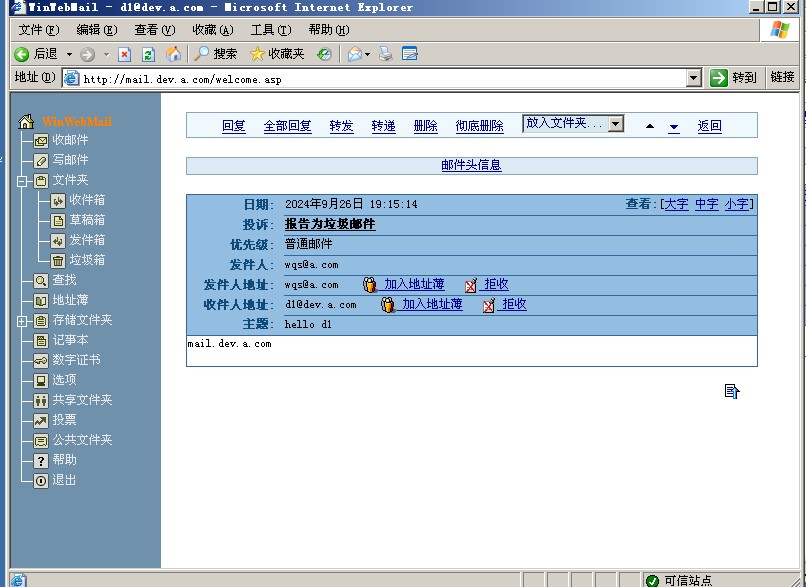


wqs@c.edu用户登录到mail.c.edu邮件界面，发送邮件给用户c1@c.edu.

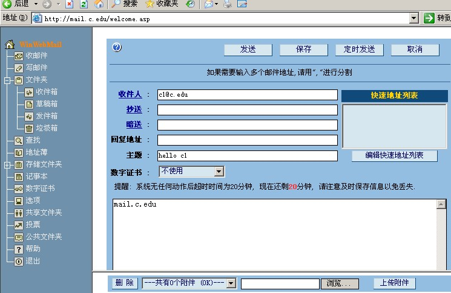

用户c1登录到mail.c.edu，接收到

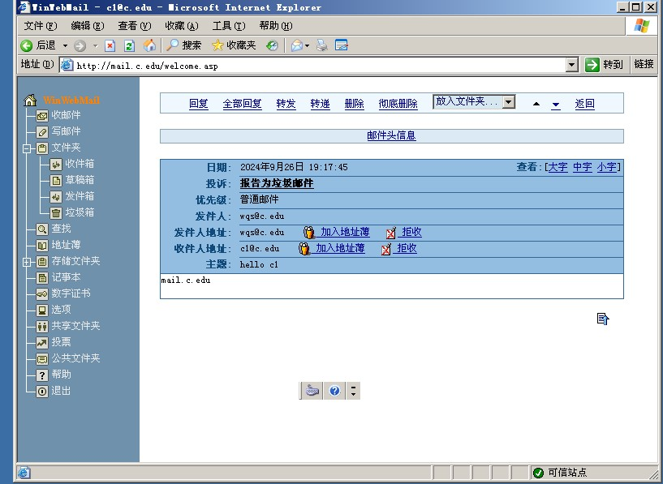


### 未解决的问题：

1、脚本中ping的次数和频率无法同时限制，只能限制其一。


