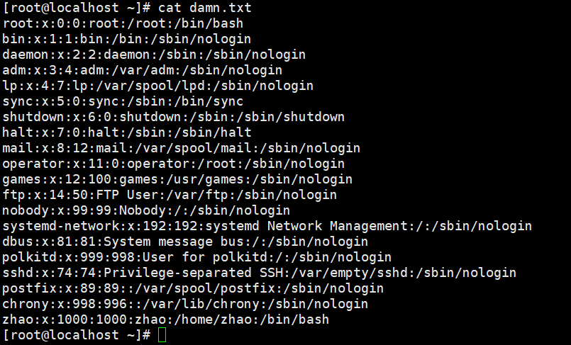
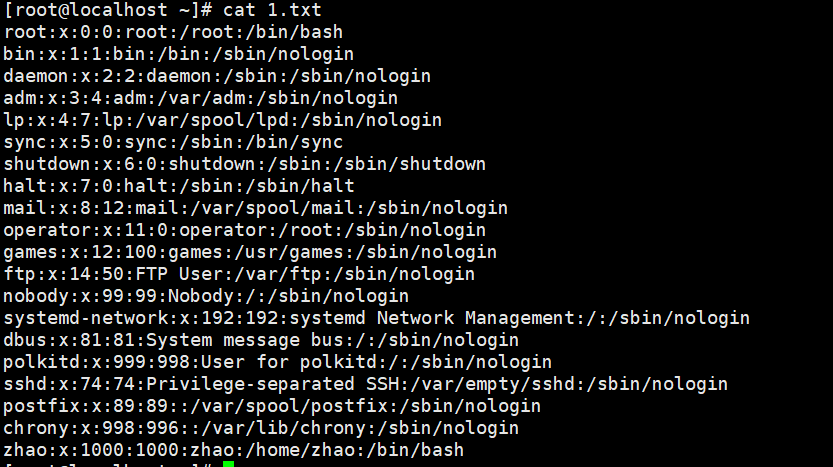

实现自己的 CP 程序 ，两个版本，版本1 使用 单字符作为缓冲区 ，版本2使用 数组作为缓冲区，对比两个程序计算运行时间 (使用time )验证缓冲区大于8192时的变化。提交详细的实现和验证过程 以及 结论附属 小组组内评分


**单字节copy**

1.编辑cp文件

```
#include <sys/types.h>
#include <sys/stat.h>
#include <fcntl.h>
#include <unistd.h>
//通过命令man 2 read查看所需的文件头，并写入
int main (){
int fd = 5555555;
fd = open("damn.txt",O_RDONLY);
//打开damn.txt文件，标识符为fd，设置权限为：可读可写
char sz;
//生成sz为字符串类型缓冲区
int cw = 999999;
cw =  open("1.txt",O_RDWR|O_CREAT,S_IRWXU);
//打开1.txt文件，标识符为cw，设置权限为：可读可写。若没有该文件，则创建文件
while(read(fd,&sz,1)==1){
            write(cw,&sz,1);
    }
//进入该循环，读取标识符为fd的文件，若fd文件含有内容，则返回值为1，满足条件进入循环:将标识符为cw的1.txt文件写入到缓冲区sz中，每次循环完成写入一个字节，直到循环结束
if(fd < 0){
    ssize_t wc = write(1,"cuowu",5);
    return 111;
    }
    else{
    if(write(fd,"zhao",4)!=4){
            close(fd);
    }
    close(fd);
    return 0;
    }

}
```

2.生成大文件

```
cat /etc/passwd > damn.txt//生成大文件
cat damn.txt//查看大文件
```



3.运行read文件

```
gcc -o read readdm.c//生成名字为read的可执行文件
./read   //执行read文件
cat 1.txt  //查看1.txt文件，得出read文件执行成功
```



4.测试运行时间

```
time read //测试运行时间
```


5.得出结果

得出单字节copy运行时间较长，为0m14.303

