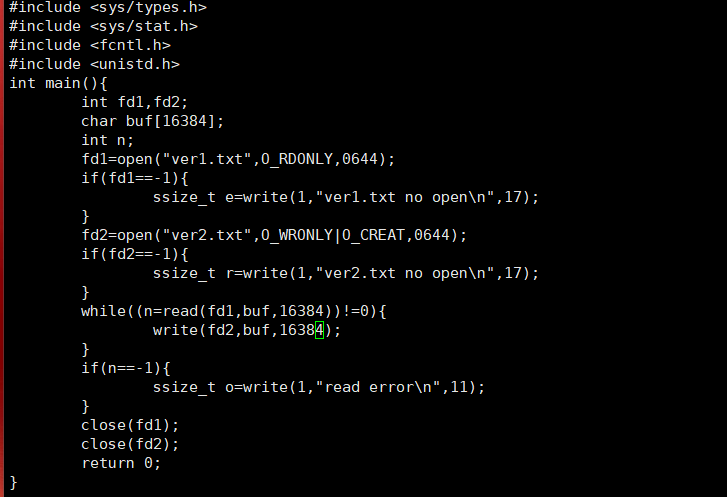

课堂实践： 实现自己的 cp 程序 ， 两个版本， 版本1 使用 单字符作为缓冲区 ， 版本2使用 数组作为缓冲区， 对比两个程序 计算运行时间 （使用time ） ，验证缓冲区大于8192时的变化 。 

1、以下为使用数组作为缓冲区代码，使用vi创建Version2.c文件,并编写该文件

```
#include <sys/types.h>
#include <sys/stat.h>
#include <fcntl.h>
#include <unistd.h>
int main(){
        int fd1,fd2;    //定义两个整数变量，fd1和fd2用来存储文件描述符
        char buf[64];   //定义数组buf长度64
        int n; 		//定义整数
        fd1=open("ver1.txt",O_RDONLY,0644);  //使用fd1储存ver1.txt文件的文件描述符，只读模式，权限设置为644
        if(fd1==-1){             
                ssize_t e=write(1,"ver1.txt no open\n",17);    
                //open读取成功后会返回读取数据的字节数，失败返回-1
                如果打开失败，将在屏幕上输出错误提示：ver1.txt no open。
        }
        fd2=open("ver2.txt",O_WRONLY|O_CREAT,0644);		//将使用fd2储存ver2.txt文件的文件描述符，读写模式，权限设置为644
        if(fd2==-1){
                ssize_t r=write(1,"ver2.txt no open\n",17);
                 //判断文件ver1.txt是否打开成功。
                如如果打开失败，将在屏幕上输出错误提示：ver2.txt no open
        }
        while((n=read(fd1,buf,64))!=0){        //使用while循环，条件是read返回值不等于0。
        	   //read(fd1,buf,64)：从文件描述符fd1中读取数据到缓冲区buf，最多读取64个字符。
                write(fd2,buf,64);      //如果read函数成功读取到了数据（n!=0），执行该函数
               //write(fd2,buf,64)：将缓冲区buf中的64字节数据写入到文件描述符fd2对应的文件里
        }
        if(n==-1){
                ssize_t o=write(1,"read error\n",11);
                //read读取成功后会返回读取数据的字节数，失败返回-1
                如果打开失败，将在屏幕上输出错误提示：read error
        }
        close(fd1); //结束文件描述符fd1
        close(fd2); //结束文件描述符fd2
        return 0; 
}

```

总体代码编辑如下图所示：


2、使用gcc命令编译上述代码文件

使用命令：gcc -o Version2 Version2.c


将文件Version2.c 文件编译成可执行文件Version2'


3、运行可执行文件Version2

使用命令：./Version2


使用命令：echo $? 查看程序是否运行成功


值为0说明运行成功

4、生成大文件并将大文件内容放入ver1.txt文件里

使用命令：dd	if=/root of=rumenz.txt bs=1M count=100 在用户目录下生成一个名为rumenz.txt 大小为100Mb的文件


​	

使用命令：cat  /root/rumenz.txt > ver1.txt 将文件rumenz.txt 内容移动到ver1.txt 文件内


使用命令：ll  验证移动数据是否成功


可以看到数据移动成功

5、查看ver1.txt文件复制到ver2.txt文件所需时间

使用命令:time ./Version2


得出版本2使用 数组作为缓冲区拷贝100M大小的文件仅需0.953s

6、当缓冲区大小大于8192时出现的情况

vi 进入Version2.c文件将缓冲区大小改为16384



使用命令：gcc -o Version2 Version2.c 编译Version2.c文件成为可执行文件Version2


执行命令并验证时间


增加缓冲区大小大于8192后所需时间从0.953s减少到 0.054s


