# linux系统基础 综合作业

要求创建自己的工具箱mytools，  通过工具箱快速调用自己创建的工具，如  查看文件状态的  mystat(仿stat)   ，   查看目录列表的  myls （仿ls -lia）  ，    复制文件的mycp（仿cp能拷贝文件即可），  查看当前系统内存信息   mymi（读取 /proc/meminfo），   使用方式要求为如下形式   。

## 一、mycp复制文件功能的实现

### （一）设计思路与预期结果

​		1.设计思路

​		 该程序的主要功能是在命令行输入两个文件名后，将第一个文件的内容复制到第二个文件中。 具体步骤为：1.打开第一个文件以只读模式。2.创建或打开第二个文件以写入模式。3.从第一个文件中读取数据并写入到第二个文件。4.处理错误并输出相应的信息。

​		2.预期结果

​		完成对文件的复制

### （二）代码实现及详细解释

​		1.引入必要的文件头

```c
#include <sys/types.h>
#include <sys/stat.h>
#include <fcntl.h>
#include <unistd.h>
#include <stdio.h>
```

​		2.定义主函数，`argc`是命令行参数的数量，`argv` 是指向每个命令行参数的字符串数组。

```c
int main(int argc,char *argv[])
{
        int fd1,fd2;  //fd1 和 fd2存储打开文件的文件描述符。
        char buf[16384];  //存储读取的文件内容的缓冲区，大小 16KB
        int n;//用于保存读取操作的返回值，即实际读取的字节数。
```

​		3.参数检查

```c
  if(argc<3){
                printf("%s,%s,%s\n",argv[0],argv[1],argv[2]);
        }
   \\检查命令行参数的数量。如果参数数量小于 3,输出程序名和两个参数名。
```

​    	 4.文件打开

```c
  fd1=open(argv[1],O_RDONLY,0644);//以只读模式打开用户指定的源文件 
        if(fd1==-1){
                ssize_t e=write(1,"ver1.txt no open\n",17);
        }
        //检查源文件是否成功打开。如果 fd1 为 -1 代表打开失败，输出错误信息到标准输出。
        fd2=open(argv[2],O_WRONLY|O_CREAT,0644);
        //尝试以写入模式打开或创建目标文件 argv[2]
        if(fd2==-1){
                ssize_t r=write(1,"ver2.txt no open\n",17);
        }
        //检查目标文件是否成功打开。如果 fd2 为 -1 代表打开失败，输出错误信息到标准输出。
```

​       5.文件复制

```c
 while((n=read(fd1,buf,16384))!=0){
                write(fd2,buf,16384);
        }
        //循环读取源文件的内容，并写入到目标文件。
```

​        6.错误检验

```c
if(n==-1){
                ssize_t o=write(1,"read error\n",11);
        }
        //检查读取数据时是否发生错误。如果 read 返回 -1，输出错误信息到标准输出。
```

​        7.关闭文件

```c
		close(fd1);
        close(fd2);
        //关闭打开的文件描述符，释放系统资源
```

​     	8.程序结束

```
   return 0;
}
```

### （三）验证

​		使用命令：

```
gcc -o Version2 Version.c		
```

​		使用命令：

```
vi 1.txt //在里面输入xcat
./Version2 1.txt 2.txt
```

​		使用命令`vi 2.txt`验证结果 


发现文档复制成功。

## 二、myls查看目录列表功能的实现

### （一）设计思路与预期结果

​        1.设计思路

​         模拟 `ls -lia` 命令的功能，即列出指定目录下的所有文件和子目录的详细信息，包括 inode 号码、文件类型、权限、链接数、用户 ID、组 ID、文件大小和文件名。

​        2.预期结果

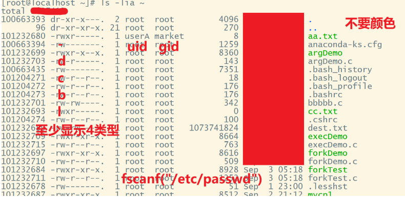

### （二）代码实现及详细解释

创建文件：vi myls.c

​        1.引入必要的文件头

```c
#include <sys/types.h>
#include <sys/stat.h>
#include <fcntl.h>
#include <unistd.h>
#include <stdio.h>
#include <stdlib.h>
#include <dirent.h>
```

​        2.创建主函数 main

​		argc是命令行参数的数量，包括程序本身

​		argv是指向字符的数组指针，每个字符串是一个命令行参数，这里存储目录路径

```c#
int main(int argc,char*argv[]){
    	//放入的代码
          ·声明变量
          ·检查命令行参数
        return 0；
 }
```

​        3.在主函数里声明变量

​        定义一个指向 DIR 类型的指针变量dir_ptr用于存储打开目录后的目录信息。

​		定义一个指向 struct dirent 类型的指针 direntp 用于存储目录项的地址 。

​		变量 pool 是一个 struct stat 类型的实例，用于存储通过 stat 函数获取的文件或目录的属性信息。

```c
        DIR * dir_ptr; 
        struct dirent *direntp;     
        struct stat pool;
```

​        4.在主函数里检查命令行参数

​		检查命令行参数的数量（argc）是否小于2（即是否提供了目录路径）。如果没有提供，则输出错误信息。

```c#
 if(argc<2){
          write(1,"usage error\n",12);
  }
```

​		5.判断是否打开目录

​		尝试打开用户指定的目录，并检查是否成功。如果打开目录失败（即 `opendir` 返回 `NULL`），则输出错误信息。

​		argev[1]中存储的是命令行参数中的第二个参数，是用户指定的路径。

​		dir_ptr中存储的是打开目录后的目录信息。

```c#
if((dir_ptr = opendir(argv[1]))==NULL){
         perror("can not open folder");
}else{
         //放入读取目录内容的代码
           ·读取目录内容
}
```

​		6.读取目录内容

​		`readdir(dir_ptr)`**：该函数用于读取目录流中的下一个目录项。这是一个标准的系统调用，用来遍历目录。`dir_ptr` 是之前用 `opendir` 打开的目录指针。

​        `direntp=readdir(dir_ptr)`**：这行将 `readdir` 函数的返回值（指向一个 `dirent` 结构的指针）赋值给 `direntp`。这时direntp中就包含了文件名和inode等信息。

```c
while((direntp=readdir(dir_ptr))!=NULL){
  		//放入实现具体功能的代码
  		  ·输出inode
  		  ·获取文件状态信息
  		  ·判断文件类型
  		  ·输出文件权限
  		  ·判断文件连接数
  		  ·判断文件用户ID
  		  ·判断所在组ID
  		  ·判断文件大小
}
```

​		7.输出inode

​		`%11.2ld`表示11位长整型，不满足11位，则会在左侧填充空格

​		direntp->d_ino; 一个指向`struct dirent`类型的指针`direntp`，通过`d_ino`成员可以获得inode号码。

```c
  printf("%11.2ld ",direntp->d_ino); 
```

​		8.判断文件类型

 		`stat(direntp->d_name,&pool);`这段代码的主要功能是获取当前遍历到的目录项（文件或子目录）的状态信息，并将这些信息存储在 pool 变量中。

​		`pool.st_mode` 是从 `stat` 结构体中获取的文件模式信息。

​		如果 `pool.st_mode` 表示一个普通文件，则 `S_ISREG(pool.st_mode)` 返回真（非零值）。

```c
stat(direntp->d_name,&pool);
if(S_ISREG(pool.st_mode)){ 
     printf("-"); //普通文件
}else if(S_ISDIR(pool.st_mode)){
     printf("d"); //目录
}else if(S_ISCHR(pool.st_mode)){
     printf("c"); //设备文件
}else if(S_ISBLK(pool.st_mode)){
     printf("b"); //块设备文件
}else if(S_ISFIFO(pool.st_mode)){
     printf("p"); //管道
}else if(S_ISLNK(pool.st_mode)){
     printf("l"); //符号链接
}else if(S_ISSOCK(pool.st_mode)){
     printf("s"); //套接字
}else{
     printf("?");
}
```

​		9.输出文件权限

​		因为mystat功能中需要使用相同的函数，所以将该函数放在文件 print_permission.c中以方便调用。

​		该函数内容如下：

​		`void print_permission(mode_t mode)`：`mode`是主函数传递的参数

​		`S_IRUSR`：这是一个宏定义，表示文件或目录对所属组的执行权限。

​		`if(mode&S_IRUSR)`：`mode&S_IRUSR`：这是一个按位与操作，用于检查`mode`变量中是否设置了`S_IRUSR`对应的位。如果设置了该位，结果为非零值（真，用户有读权限），否则结果为零（假，用户没有读权限用-代替）。

```c
#include <sys/types.h>
#include <sys/stat.h>
#include <fcntl.h>
#include <unistd.h>
#include <stdio.h>
#include <stdlib.h>
#include <dirent.h>
void print_permission(mode_t mode){
        if(mode&S_IRUSR){    //用户读权限
                printf("r");

        }else{
                printf("-");
        }
        if(mode&S_IWUSR){	//用户写权限
                printf("w");
        }else{
                printf("-");
        }
        if(mode&S_IXUSR){	//用户执行权限
                 printf("x");
        }else{
                printf("-");
        }
        if(mode&S_IRGRP){	//所属组读权限
                printf("r");
        }else{
                printf("-");
        }
        if(mode&S_IWGRP){	//所属组写权限
                printf("w");
        }else{
                printf("-");
        }
        if(mode&S_IXGRP){	//所属组执行权限
                printf("x");
         }else{
                printf("-");
        }
        if(mode&S_IROTH){	//其他人读权限
                printf("r");
        }else{
                printf("-");
        }
        if(mode&S_IWOTH){	//其他人写权限
                 printf("w");
        }else{
                printf("-");
         }
        if(mode&S_IXOTH){	//其他人执行权限
                printf("x");
        }else{
                printf("-");
        }
}
```

​		调用函数print_permission将pool.st_mode传递给该函数

```c
 print_permission(pool.st_mode);
```

​		10.判断文件链接数

​		`st_nlink`是`struct stat`结构体中的一个成员，表示文件的硬链接数。

​		`pool.st_nlink`:输出文件的硬链接数。

```c
	printf("%3d ",pool.st_nlink);
```

​		11.判断用户和组ID

​		`st_uid是`struct stat`结构体中的一个成员，表示文件用户ID

​		`st_gid是`struct stat`结构体中的一个成员，表示所在组的ID

```c
	printf("%5d ",pool.st_uid); //判断文件用户 ID
    printf("%5d ",pool.st_gid); //判断所在组的 ID
```

​		12.判断文件大小

​		`pool.st_size是`struct stat`结构体中的一个成员，表示文件大小

```c
	printf("%8ld ",pool.st_size);
```

​		13.判断文件名称

​		`direntp->d_ino;` 一个指向`struct dirent`类型的指针`direntp`，通过`d_name`成员可以获得文件名称。

```
    printf("%s\n",direntp->d_name);
```

### （三）验证	

​		使用命令：

```
gcc print_permission.c myls.c -o myls 
```

​		没有提示错误

​		将文件 print_permission.c myls.c编译成可执行文件myls

​		使用命令：

```
./myls /root
```

​		输出结果：

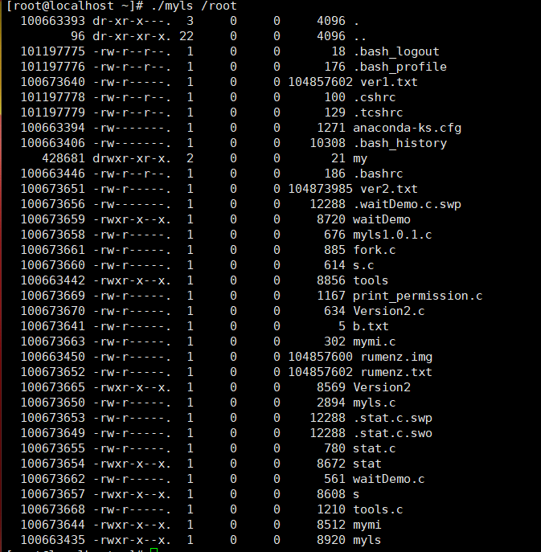

### （四）结论

​		`myls.c` 文件是通过遍历指定目录中的每一个条目，获取并输出每个条目的详细信息，包括 inode 号码、文件类型、权限、链接数、用户 ID、组 ID、文件大小和文件名。

## **三、mystat打印文件状态信息功能的实现**

### **（一）设计思路与预期结果**

​		1.设计思路

​		1.1本代码的核心功能是打印出文件状态信息，包括：文件名、文件大小、inode号、硬链接数、gid、uid、权限类型、文件类型。声明一个`stat`结构体pool用于存储文件状态信息，将获取到的文件状态信息存储在pool中，并打印出来

​		2.预期结果

​		2.1打印出以下信息

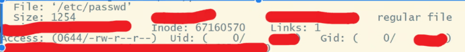

### （二）代码实现及详细解释

​		1.引入必要的文件头

```c
		#include <sys/types.h>
		#include <sys/stat.h>
		#include <fcntl.h>
		#include <stdio.h>
		#include <unistd.h>
		//引入必要的头文件
```

​			2.定义主函数，`argc`是命令行参数的数量，`argv` 是指向每个命令行参数的字符串数组。`  num1, num2, num3, num4 `用于跟踪用户、组和其他用户的权限数字表示形式的变量。 

```c
		int main(int argc,char* argv[])
		{
			int inFile;  // 声明一个整型变量用于存储文件描述符。 
        	int num1=0;
        	int num2=0;  
        	int num3=0;  
        	int num4=0;  

```

​			3.设置文件创建时的权限掩码 

```c
  			umask(0002); 
```

  			4.参数检查

```c
			if(argc < 2){
                	write(1,"usage error\n",12);
        	}  // 检查是否提供了足够的命令行参数。如果参数少于2个，打印错误信息。
```

  			5.打开文件

```c
  			inFile = open(argv[1],O_RDONLY);  //  以只读模式打开命令行参数中的第一个文件。 
       	 	if ((inFile == -1 )){
       	  	       write(1,"file not open!\n",15);
       	  	       return 126;
       		 }  // 检查文件是否成功打开。如果打开失败，打印错误信息并返回错误代码126。 
```

​       		6.获取文件信息

```c
			struct stat pool;  // 声明一个`stat`结构体pool用于存储文件状态信息。 
        	stat(argv[1],&pool);  // 获取文件的状态信息并存储在`pool`中。 
```

​      		7.打印文件名、文件大小、inode号、硬链接数、用户ID、组ID

```c
			printf("File:%s\n",argv[1]);  //打印文件名 。
        	printf("size:%d\n",pool.st_size);  //用参数st_size打印文件大小。
        	printf("inode:%d\n",pool.st_ino);  //用参数st_ino打印文件inode。
       	 	printf("links:%d\n",pool.st_nlink);  //打印文件硬链接数。
       	 	printf("uid:%d\n",pool.st_uid);  // 打印文件的用户ID。 
        	printf("gid:%d\n",pool.st_gid);  // 打印文件的组ID。
```

​    			8.文件类型判断， 用 `S_ISREG`、`S_ISDIR` 等宏判断文件类型，其中的参数是文件的模式信息，判断完成后打印相应的字符： 

​				`pool.st_mode`:是从 `stat` 结构体中获取的文件模式信息。

```c
 						printf("Access:(");  
       					if(S_ISREG(pool.st_mode)){
                                printf("-");//普通文件
                        }else if(S_ISDIR(pool.st_mode)){
                                printf("d");//目录
                        }else if(S_ISCHR(pool.st_mode)){
                                printf("c");//字符设备
                        }else if(S_ISBLK(pool.st_mode)){
                                printf("b");//块设备。
                        }else if(S_ISFIFO(pool.st_mode)){
                                printf("p");//FIFO（命名管道）。
                        }else if(S_ISLNK(pool.st_mode)){
                                printf("l");//符号链接。
                        }else if(S_ISSOCK(pool.st_mode)){
                                printf("s");//套接字
                        }else{
                                printf("?");//未知类型。
                        }//通过检查 pool.st_mode 中的文件信息来判断文件类型，并输出相应的字符表示该类型。
```

​     	9.函数调用，调用一个自定义的print_permission函数

```c
						print_permission(pool.st_mode);
```

​         10.打印文件权限`num1,num2,num3,num4c'`

```c
						printf("//%d%d%d%d",num1,num2,num3,num4);  //打印文件的权限
                   		printf(")\n"); 	
```

​		11.执行完毕

```c
			return 0;
		}
```

​		12.print_permission函数内容的解释

​		12.1判断用户权限  ，并输出相应字符, 使用变量 `num2` 来累加相应的权限值 

```c
 						if(pool.st_mode&S_IRUSR){
                                printf("r");
                                num2=num2+4;//读权限（S_IRUSR），输出 "r"，并将 num2 增加 4。
                        }else{
                                printf("-");//如果相应权限不存在，则输出 "-"。
                        }
                        if(pool.st_mode&S_IWUSR){
                                printf("w");
                                num2=num2+2;//写权限（S_IWUSR），输出 "w"，并将 num2 增加 2。
                        }else{
                                printf("-");//如果相应权限不存在，则输出 "-"。
                        }
                        if(pool.st_mode&S_IXUSR){
                                printf("x");
                                num2=num2+1;//执行权限（S_IXUSR）,输出 "x"，并将 num2 增加 1。
                        }else{
                                printf("-");//如果相应权限不存在，则输出 "-"。
                        }  
```

​               12.2判断组权限  ，并输出相应字符,使用变量 `num3` 来累加相应的权限值        

```c
					if(pool.st_mode&S_IRGRP){

                           printf("r");
                            num3=num3+4;//读权限（S_IRGRP），输出 "r"，并将 num3 增加 4。
                    }else{
                            printf("-");//如果相应权限不存在，则输出 "-"。
                    }
                    if(pool.st_mode&S_IWGRP){
                            printf("w");
                            num3=num3+2;//写权限（S_IWGRP），输出 "w"，并将 num3 增加 2。
                    }else{
                            printf("-");//如果相应权限不存在，则输出 "-"。
                    }
                    if(pool.st_mode&S_IXGRP){
                            printf("x");
                            num3=num3+1;//执行权限（S_IXGRP）,输出 "x"，并将 num3 增加 1。
                    }else{
                            printf("-");//如果相应权限不存在，则输出 "-"。
                    }
```

​          12.3判断其他用户权限  ，并输出相应字符, 使用变量 `num4` 来累加相应的权限值       

```c
	    			if(pool.st_mode&S_IROTH){
                            printf("r");
                            num4=num4+4;//读权限（S_IROTH），输出 "r"，并将 num4增加 4。
                    }else{
                            printf("-");//如果相应权限不存在，则输出 "-"。
                    }
	    			if(pool.st_mode&S_IWOTH){
                            printf("w");
                            num4=num4+2;//读权限（S_IWOTH），输出 "w"，并将 num4增加 2。
                    }else{
                            printf("-");//如果相应权限不存在，则输出 "-"。
                    }
                    if(pool.st_mode&S_IXOTH){
                            printf("x");
	                        num4=num4+1;//读权限（S_IXOTH），输出 "x"，并将 num4增加 1。
                    }else{
                            printf("-");//如果相应权限不存在，则输出 "-"。
                    }		
```

### **（三）验证**

使用命令：

```c
gcc print_permission.c mystat.c -o mystat //编译成可执行文件
```

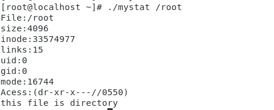


`mystat`工具得到了预期的结果


## 四、mymi（读取 /proc/meminfo)功能的实现

### （一）设计思路与预期结果

1、设计思路

程序将包含两个主要部分：print_meminfo函数和main函数。
print_meminfo函数负责读取和打印内存信息。
main函数负责程序的启动和结束。

编写print_meminfo函数:
使用标准函数fopen打开/proc/meminfo文件。
检查文件是否成功打开，如果没有，则打印错误信息并退出。
使用一个循环和fgets函数读取文件的每一行。
对于每一行，使用strstr函数检查是否包含特定的关键词。
如果包含，使用printf函数将整行内容打印到标准输出。
循环结束后，使用fclose关闭文件。

编写main函数:
打印一条信息提示用户即将显示内存信息。
调用print_meminfo函数。
程序执行完毕后，返回0表示成功。

2、预期结果

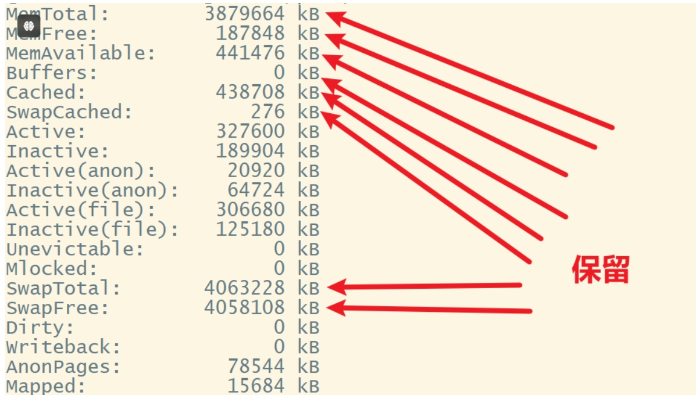

### （二）整体代码实现及详细解释

1.引入必要的文件头：

```c
#include <stdio.h>     //预处理指令，标准输入输出库stdio.h，
#include <stdlib.h>    //标准库stdlib.h
#include <string.h>    //字符串处理库string.h
```

2、定义缓冲区

```c
#define BUFFER_SIZE 256    //定义一个宏命名为buffer__size(缓冲区），定义值为256。
```

3、定义函数

```c
void print_meminfo() {    
//定义函数命名为print_meminfo（打印内存信息），返回类型为void。
```

4、声明指针

```c
    FILE *file = fopen("/proc/meminfo", "r"); 
//r表示以只读的模式打开文件，声明一个指针，
//FILE *file用于储存文件打开操作的结果，fopen函数返回一个指向FILE结构的指针，
//通过使用file指针，程序可以使用标准库函数fgets来读取文件内容。
```

5、条件判断语句

```c
if (!file) {，                      //条件判断语句，！为逻辑非运算符。
        perror("fopen");                                       
        exit(EXIT_FAILURE);        //判断file指针是否为null，如果file为null，说明文件打开失败，
    }                              //perror函数将会打印出与fopen相关的错误信息，
                                   //并且调用exit函数退出。
```

6、声明字符数组

```c
char buffer[BUFFER_SIZE];          //声明一个字符数组buffer，大小由宏（buffer_size）指定（256），char表示数组中储存的为字符数据
```

7、设置循环

```c
    while (fgets(buffer, sizeof(buffer), file)) 
//设置一个循环，使用fgets函数从文件file中读取数据到buffer中，最多读取sizeof（buffer）-1个字符，成功读取会返回buffer的指针，循环继续；读取失败会返回null，循环终止。    
    {   
        if (strstr(buffer, "MemTotal:") || strstr(buffer, "MemFree:") || 
            strstr(buffer, "MemAvailable:") || strstr(buffer, "Buffers:") || 
            strstr(buffer, "Cached:") || strstr(buffer, "SwapCached:") || 
            strstr(buffer, "SwapTotal:") || strstr(buffer, "SwapFree:")) {
            printf("%s", buffer);
        }
    }
//，条件判断，检查buffer字符串是否包含""中的关键词，找到匹配的字符串时会返回一个指针，否则返回null。
```

8、循环结束

```c
  fclose(file);
}
//fclose函数在循环结束后用于关闭之前打开的文件，来释放与文件相关的资源。
```

9、主函数

```c
int main() {
    printf("Current memory information:\n");
    print_meminfo();
    return 0;
}
//使用printf打印出提示信息，调用之前定义的print_meminfo函数，执行打印操作。
```

### （三）验证结果

1、使用linux虚拟机vi创建c语言文件，命令为：

```
vi mymi.c
```

  写入代码。

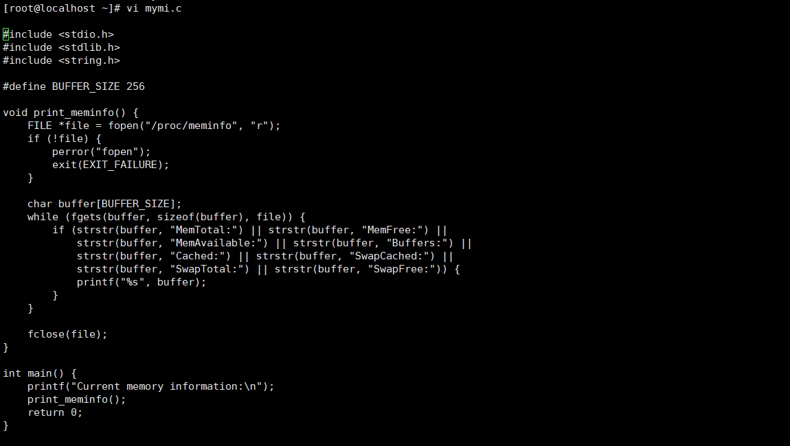

2、使用gcc编译并运行，命令为：

```
gcc -o mymi mymi.c
```

```
./mymi
```

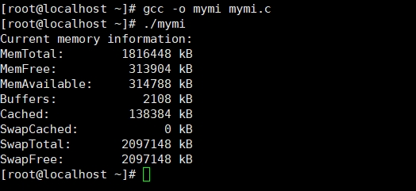

3、查看/proc/meminfo文件得出结果与预期结果相同。

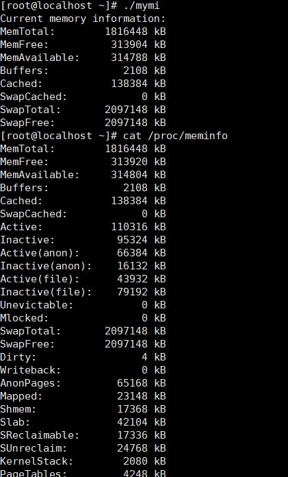

## 五、工具箱的功能实现与验证

### （一）设计思路与预期结果

​		1.设计思路

​		1.1读取用户输入：使用fgets函数从标准输入读取用户输入。

​		1.2处理输入：将用户输入内容进行处理，通过循环存入数组中。

​		1.3调用输入：直接调取数组中的元素，即可调用出用户输入的命令

​		1.4命令判断：进行命令判断，判断用户使用的工具类型

​		1.5调用工具：使用execl命令调取工具箱中的工具

​		2.预期结果


通过调用各种工具来实现不同的功能

​		3.前驱图

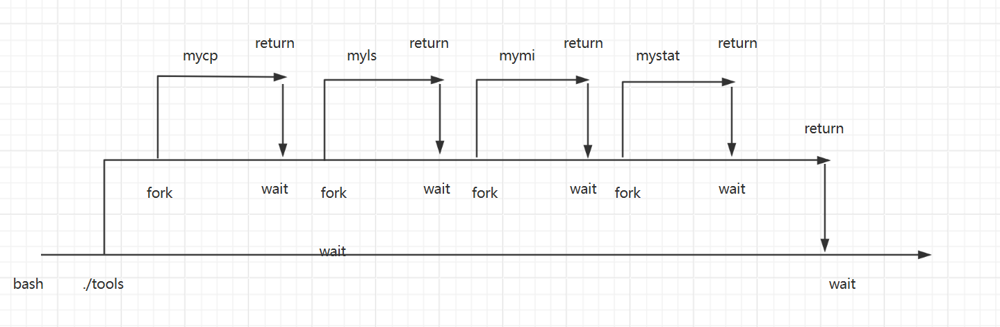

### （二）代码实现及详细解释

​		1.引入必要的文件头

```c
#include <sys/types.h>
#include <sys/stat.h>
#include <fcntl.h>
#include <unistd.h>
#include <stdio.h>
#include <stdlib.h>
#include <dirent.h>
#include <string.h
```

​		2.主函数中变量声明

```c
int main(int argc, char *argv[])
{
    char input[1024]; 
    char *args[10];
    int arg_count = 0;
    pid_t pid;
}
```

​		3.1读取分割数据：使用fgets函数对输入内容进行读取，设置最大字节数为1024，并判断输入的数据是否为空，若不为空则向下执行，再使用strtok函数对输入的内容以空格进行分割，然后存入到token指针中。

```c
 while (1)
    {
        printf("#<tools>");
        if (fgets(input,1024, stdin) != NULL)
        {
            input[strcspn(input, "\n")] = 0;    // 去掉换行符
            char *token = strtok(input, " ");     // 使用 strtok 分割输入字符串
            arg_count = 0;    //初始化字符串
```

​		3.2将读取到的值存入数组中：通过while循环，将token分割出来的值存入到args数组中，若strtok第一个参数值为NULL，则继续分割上一次调用strtok时传入的字符串，strtok会记住上一次分割的位置。

```c
while (token != NULL && arg_count < 10) {
                args[arg_count++] = token;
                token = strtok(NULL, " ");
            }
```

​		3.3判断用户输入的值对应mycp工具的调用：使用strcmp函数，第一个参数为用户输入的第一个字符串（数组中的第0个元素），同第二个参数“mycp”进行判断，若返回值为0则证明用户想要调用mycp工具，然后创建子进程，在子进程中使用execl函数实现对mycp工具的调用。

```c
if (strcmp(args[0], "mycp") == 0)
            { 
                if (arg_count < 3) {             //若用户过少的输入参数，则提示用户补全代码
                    fprintf(stderr, "Usage: mycp <source> <destination>\n"); 
                    continue;
                }
                pid = fork();            //创建子进程
                if (pid == 0)            
                {
                    //excl函数参数分别为调用工具的路径，程序名称，copy文件的路径，copy到的路径
                    execl("/root/mycp", "/root/mycp", args[1], args[2], 0);
                    perror("execl"); // 如果 execl 失败，打印错误信息
                    exit(1);
                }
                else
                {
                    wait(NULL);  //父进程等待子进程执行完成
                }
            }
```

​		3.4判断用户输入的值对应myls工具的调用：使用strcmp函数，第一个参数为用户输入的第一个字符串（数组中的第0个元素），同第二个参数“myls”进行判断，若返回值为0则证明用户想要调用myls工具，然后创建子进程，在子进程中使用execl函数实现对myls工具的调用。（代码解释同上）

```c
else if(strcmp(args[0],"myls")== 0){
                    if (arg_count < 2) {
                                fprintf(stderr, "Usage: myls <directory>\n");
                                continue;
                        }
                pid = fork();
                if (pid == 0)
                {
                    execl("/root/myls", "/root/myls", args[1], 0);
                    perror("execl");
                    exit(1);
                }
                else
                {
                    wait(NULL);
                }
        }
```

​		3.5判断用户输入的值对应mystat工具的调用：使用strcmp函数，第一个参数为用户输入的第一个字符串（数组中的第0个元素），同第二个参数“mystat”进行判断，若返回值为0则证明用户想要调用mystat工具，然后创建子进程，在子进程中使用execl函数实现对mystat工具的调用。（代码解释同上）

```c
    else if(strcmp(args[0],"mystat")== 0){
                    if (arg_count < 2) {
                                fprintf(stderr, "Usage: mystat <destination>\n");
                                continue;
                        }
                pid = fork();
                if (pid == 0)
                {
                    execl("/root/mystat", "/root/mystat", args[1], 0);
                    perror("execl");
                    exit(1);
                }
                else
                {
                    wait(NULL);
                }
        }
```

​		3.6判断用户输入的值对应mymi工具的调用：使用strcmp函数，第一个参数为用户输入的第一个字符串（数组中的第0个元素），同第二个参数“mymi”进行判断，若返回值为0则证明用户想要调用mymi工具，然后创建子进程，在子进程中使用execl函数实现对mymi工具的调用。（代码解释同上）

```c
   else if(strcmp(args[0],"mymi")== 0){
                pid = fork();
                if (pid == 0)
                {
                    execl("/root/mymi", "/root/mymi", 0);
                    perror("execl");
                    exit(1);
                }
                else
                {
                    wait(NULL);
                }
        }
```

​		3.7退出工具箱操作：当用户不想使用工具箱，可以通过exit命令退出循环。

```c
   else if (strcmp(args[0], "exit") == 0)     //判断输入值是否为“exit”
              {
                  break;  //停止循环
              }
```

3.8使用gcc工具编译文件，生成可执行文件即可使用

```
gcc -O tools tools.c
```

### （三）验证结果

​		1.验证进入工具箱


​		2.验证使用工具箱中myls工具

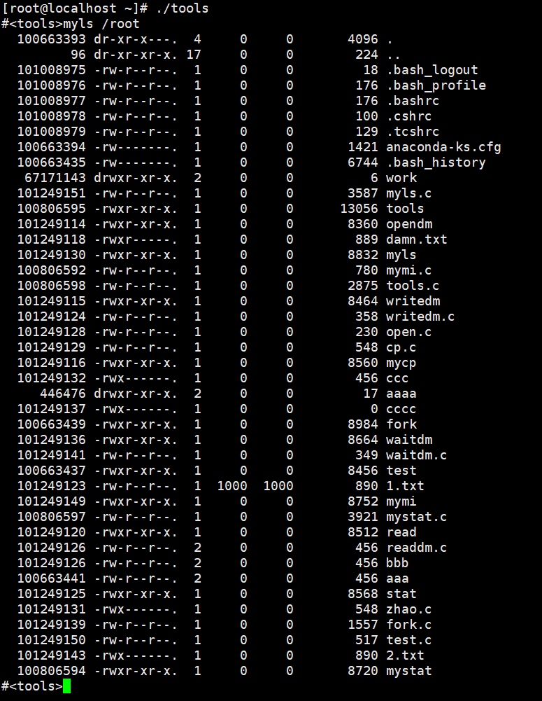

​		3.验证使用工具箱中mystat工具

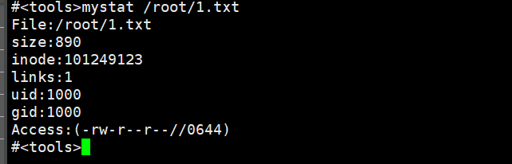

​		4.验证使用工具箱中mymi工具


​		5.验证使用工具箱中mycp工具：写入“0 group”到0.txt中，在工具箱中使用mycp工具将0.txt文件copy到55.txt文件中，通过cat命令查看55.txt文件

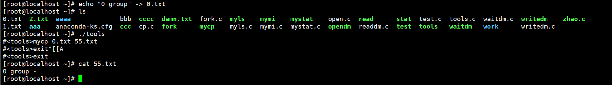

​		6.通过以上验证得出项目结果与预期结果相符，项目完成
