## 一、准备工作：

### （一）安装必要的软件包

 	首先确保安装了LVM和mdadm（用于软件RAID）的相关工具。

```bash
sudo apt-get update
sudo apt-get install lvm2 mdadm quota
```

### （二）准备硬盘

​	新建9块硬盘

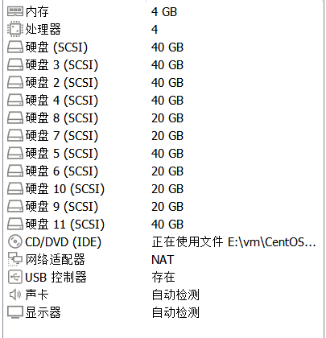

## 二、实现RAID 0、RAID 1和RAID 5：

### （一）配置RAID 0

​	RAID 0常用于提高性能，将多个磁盘的容量合并成一个逻辑卷。

```bash
sudo mdadm --create /dev/md0 --level=0 --raid-devices=2 /dev/sdb /dev/sdc
```

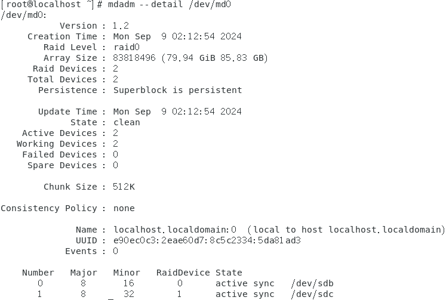

### （二） 配置RAID 1

​	AID 1用于镜像，可以提供冗余，提高数据安全性。

```bash
sudo mdadm --create /dev/md1 --level=1 --raid-devices=2 /dev/sdd /dev/sde
```

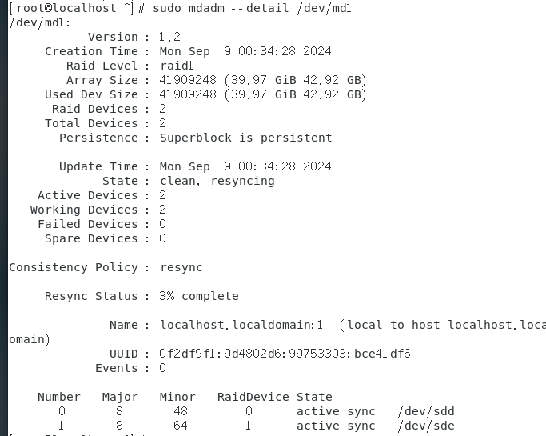

### （三）配置RAID 5

​	RAID 5可以在一定程度上兼顾性能和数据保护。

```bash
sudo mdadm --create /dev/md2 --level=5 --raid-devices=3 /dev/sdf /dev/sdg /dev/sdh
```


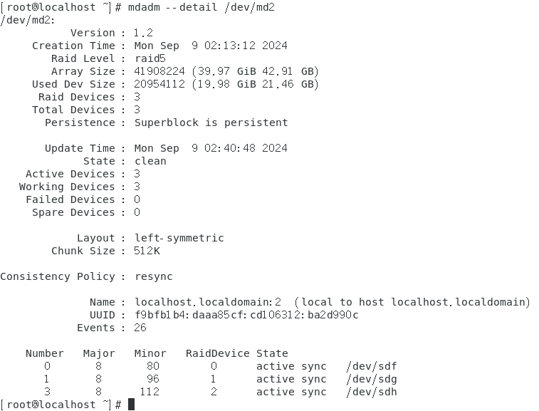

### （四）基于LVM分区和格式化：

1. 创建PV（物理卷）：

   ```bash
   sudo pvcreate /dev/md0 /dev/md1 /dev/md2
   ```

2. 创建VG（卷组）：

   ```bash
   sudo vgcreate my_vg /dev/md0 /dev/md1 /dev/md2
   ```

3. 创建LV（逻辑卷）：

   - 逻辑卷RAID 0：

     ```bash
     sudo lvcreate -L 10G -n lv_raid0 my_vg /dev/md
     ```

   - 逻辑卷RAID 1：

     ```bash
     sudo lvcreate -L 10G -n lv_raid1 my_vg /dev/md1
     ```

   - 逻辑卷RAID 5：

     ```bash
     sudo lvcreate -L 20G -n lv_raid5 my_vg /dev/md2
     ```

4. 格式化逻辑卷：

   ```bash
   sudo mkfs.ext4 /dev/my_vg/lv_raid0
   ```

   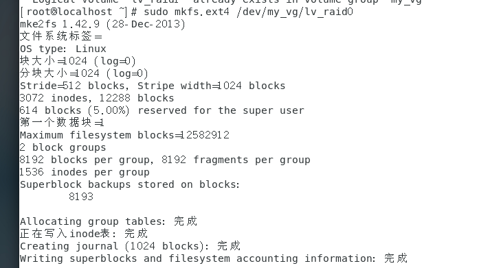

   ```bash
   sudo mkfs.ext4 /dev/my_vg/lv_raid1
   ```

   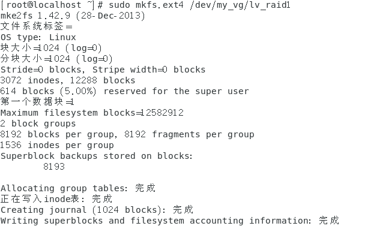

   ```bash
   sudo mkfs.ext4 /dev/my_vg/lv_raid5
   ```


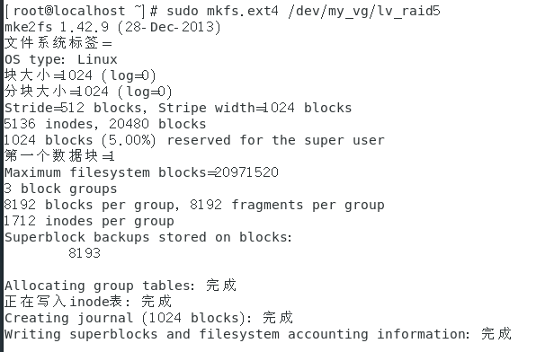

### （五）挂载及磁盘配额：

1. 创建挂载点并挂载：

   ```bash
   sudo mkdir /mnt/raid0 /mnt/raid1 /mnt/raid5
   sudo mount /dev/my_vg/lv_raid0 /mnt/raid0
   sudo mount /dev/my_vg/lv_raid1 /mnt/raid1
   sudo mount /dev/my_vg/lv_raid5 /mnt/raid
   ```


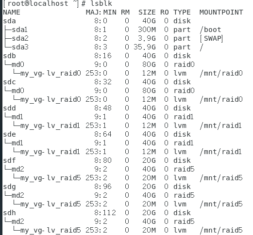

2.配置磁盘配额：

- 编辑`/etc/fstab`以启用配额，添加`usrquota`和`grpquota`：

  ```
  /dev/my_vg/lv_raid0 /mnt/raid0 ext4 defaults,usrquota,grpquota 0 2
  /dev/my_vg/lv_raid1 /mnt/raid1 ext4 defaults,usrquota,grpquota 0 2
  /dev/my_vg/lv_raid5 /mnt/raid5 ext4 defaults,usrquota,grpquota 0 2
  ```


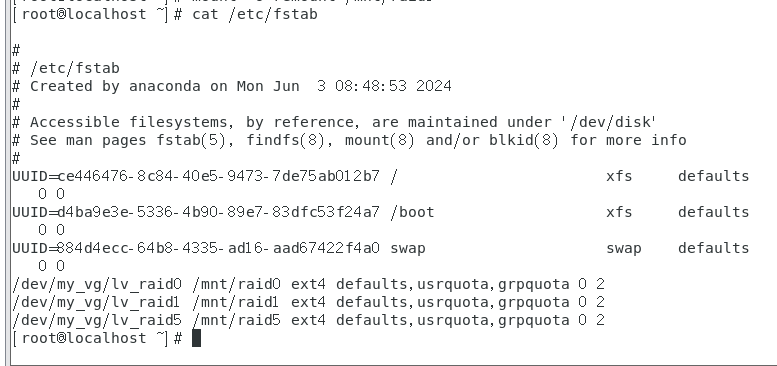

- 重新挂载文件系统以启用配额：

  ```bash
  sudo mount -o remount /mnt/raid0
  sudo mount -o remount /mnt/raid1
  sudo mount -o remount /mnt/raid5
  ```


3.初始化配额数据库：

```bash
sudo quotacheck -cug /mnt/raid0
sudo quotacheck -cug /mnt/raid1
sudo quotacheck -cug /mnt/raid5
```

4.开启并设置配额：

```bash
sudo quotaon -v /mnt/raid0
sudo quotaon -v /mnt/raid1
sudo quotaon -v /mnt/raid5
```

5.设置用户和组配额：

- 设置用户配额：

  ```bash
  sudo edquota -u xcat
  ```

- 设置组配额：

  ```bash
  sudo edquota -g xcat
  ```


6.验证

进入xcat用户，将1k的文件以4000次读入，可以看出超出磁盘限制的报错提醒。

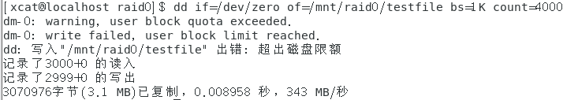

## 三、验证并恢复RAID 1和RAID 5

### （一）RAID 1的验证与恢复

​	假设RAID 1是由`/dev/sdd`和`/dev/sde`组成：

1.移除一个磁盘

​	使用`mdadm`命令将一个磁盘标记为故障并移除它：

```bash
sudo mdadm /dev/md1 --fail /dev/sdd
sudo mdadm /dev/md1 --remove /dev/sdd
```

2.检查RAID状态

​	查看阵列状态以确认失败的磁盘已被移除：

```bash
sudo mdadm --detail /dev/md1
```

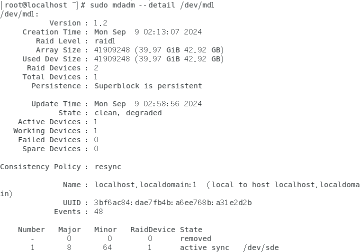

​	这里应该可以看到阵列仍然运行，但状态为降级（degraded）。

3.替换并添加新磁盘

​	有一个新的或空闲的磁盘`/dev/sdk`来替换被移除的磁盘，将其加入阵列：

```bash
sudo mdadm /dev/md1 --add /dev/sdk
```

4.检查重建进度

​	使用以下命令监视重建过程：

```bash
watch -n 1 cat /proc/mdstat
```

 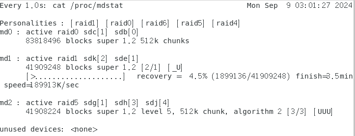

### （二）RAID 5的验证与恢复

​	假设RAID 5是由`/dev/sdf`、`/dev/sdg`和`/dev/sdh`组成：

1.移除一个磁盘

​	将一个磁盘标记为故障并移除它：

```bash
sudo mdadm /dev/md2 --fail /dev/sdf
sudo mdadm /dev/md2 --remove /dev/sdf
```

2.检查RAID状态

​	查看阵列状态：

```bash
sudo mdadm --detail /dev/md2
```

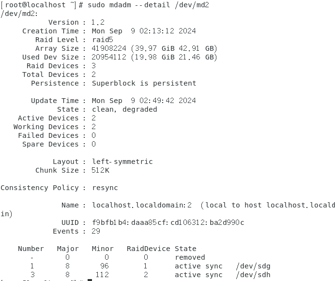

​	阵列应为降级状态。

3.替换并添加新磁盘

​	类似前述过程，使用一个新的磁盘`/dev/sdj`加入阵列：

```bash
sudo mdadm /dev/md2 --add /dev/sdj
```

4.监视重建进度：

```bash
watch -n 1 cat /proc/mdstat
```

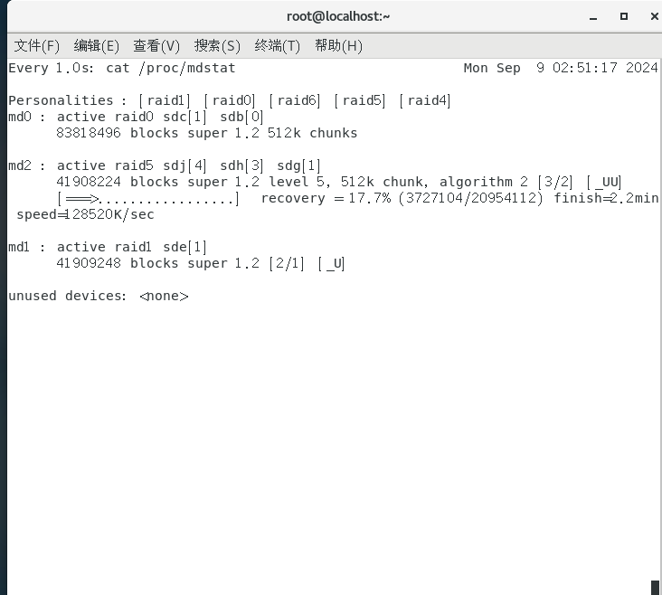


5.最后结果

​	RAID 1将空闲的磁盘`/dev/sdk`来替换被移除的磁盘

​	RAID 5将空闲的磁盘`/dev/sdj`来替换被移除的磁盘

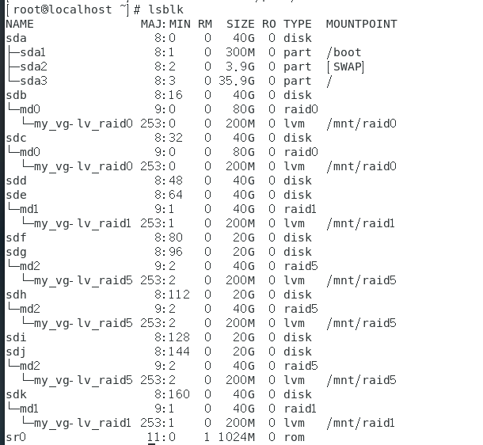


