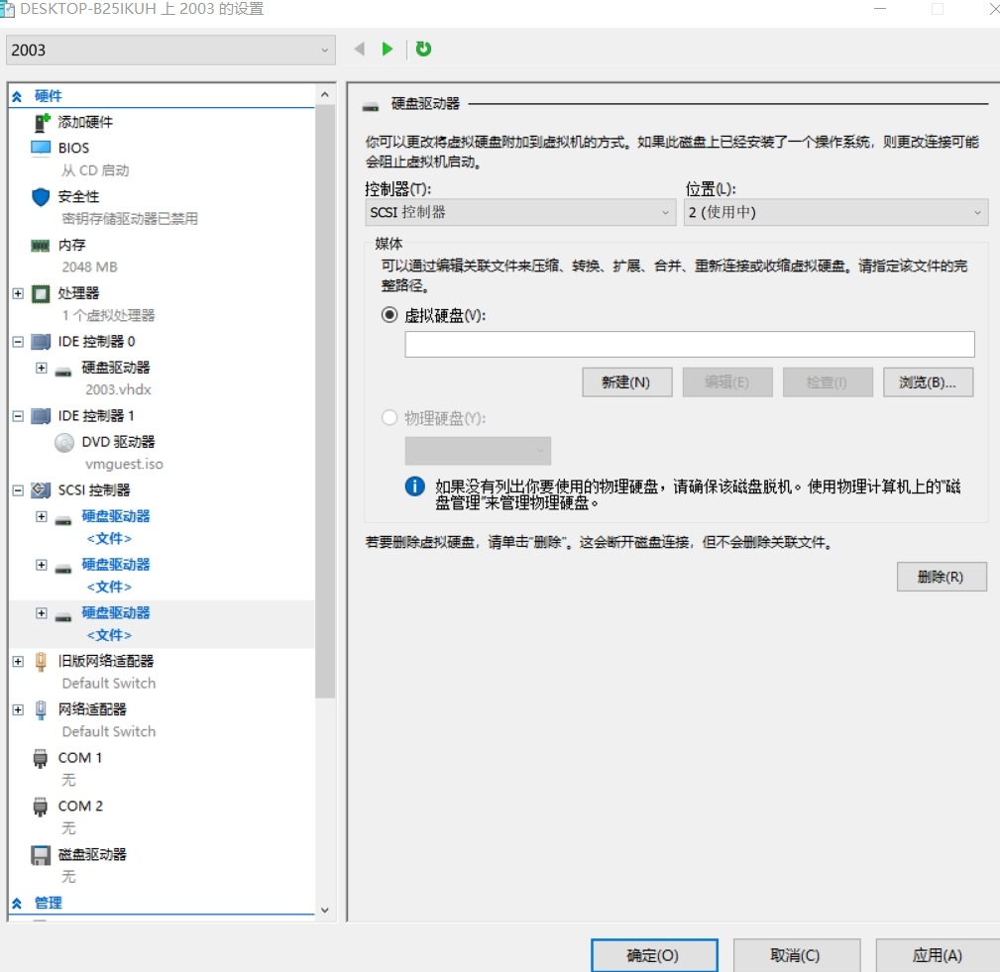
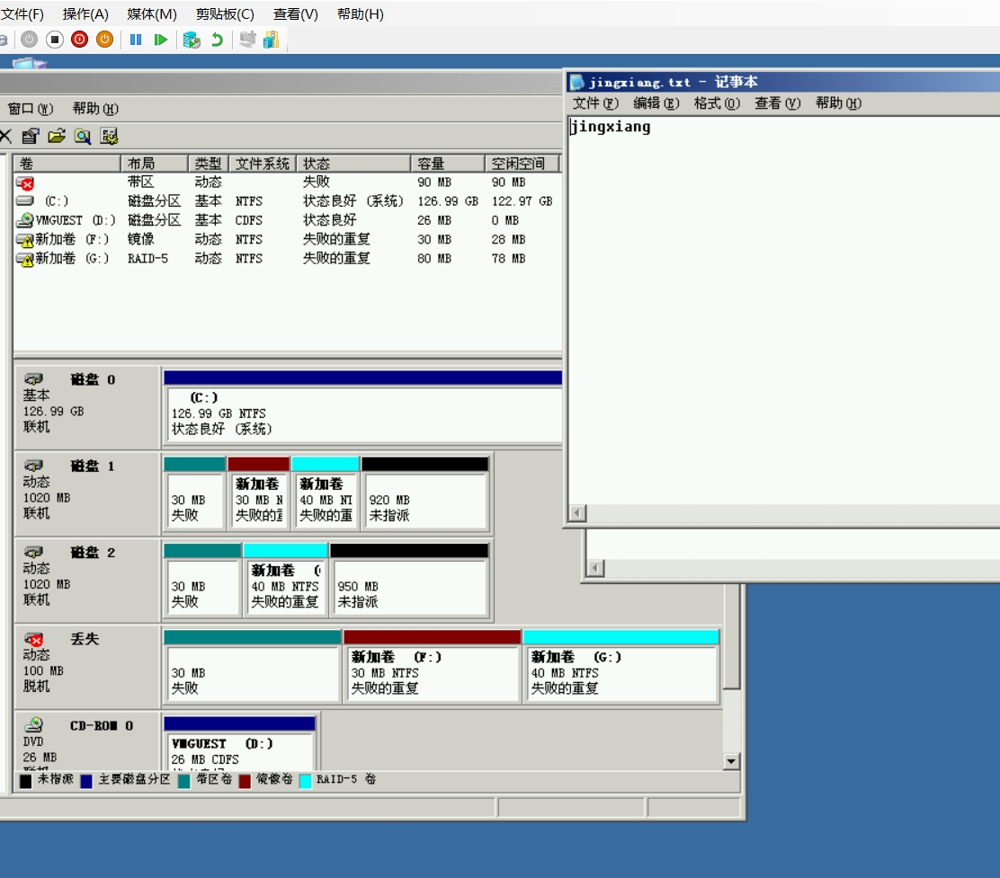

# windows： RAID 0 + RAID 1 + RAID 5 磁盘配额 进行限制

 1、在虚拟机中创建三块硬盘，用于创建RAID0,RAID1和RAID5。

2、对虚拟硬盘进行新建，点击新建，并选择位置创建。

3、开机右键我的电脑，点击管理打开计算机管理。

4、点击磁盘管理可以看到新添加的三块硬盘，右键磁盘初始化并转换到动态磁盘。

5、右键新建卷，分别添加带区（RAID0）三块硬盘，镜像（RAID1）两块硬盘，RAID-5三块硬盘。

结果如下：

6、分别在各卷中新建一个文件，用于后期查看硬盘损坏后是否可以恢复文件。

7、创建磁盘配额，右键卷点击属性打开菜单，勾选启动配额管理。

8、点击菜单中的配额项，打开后可以针对用户进行配额设置。

9、登录已限制用户

10、右键磁盘配额的卷查看属性，可以看到当前用户仅可使用10240字节空间，图9可看卷e总空间为90MB.

11、新建一个文件，写入一些文本文件（大约为1KB）

12、将文本中文件多复制几次到超过该用户可用空间10240字节点击保存后可看到系统提示磁盘空间不足。

13、删除一块硬盘，应用。

14、重启虚拟机发现出现失败的重复错误。

15、打开卷中文件，发现镜像和RAID-5中文件仍可以使用

16、关闭虚拟机，新添加一块硬盘。

17、新建虚拟硬盘。

18、如出现下图情况，应实验要求不要点击还原，直接点击继续。

19、打开计算机管理，镜像只需要右键单击删除镜像，选择丢失，完成后显示状态良好。

20、点击其它磁盘右键添加镜像可以添加其它盘位置的镜像。

21、在新加的磁盘右键再创建一个RAID-5。

22、创建后右键重新激活卷，完成RAID-5的修复。RAID0因其特性当一个硬盘失败状态所有文件全部丢失。

RAID1(镜像）:RAID 1通过将数据完整地复制到两个或多个磁盘上来提供冗余。这意味着所有的数据都会在所有的磁盘上有一份副本，在一个硬盘出错后，只要另一个硬盘没有出错仍可继续使用。

RAID0（条带化）：没有数据冗余，如果一个磁盘失败，所有数据将丢失。

RAID 5 (条带化和奇偶校验)：RAID 5结合了RAID 0的条带化和RAID 1的冗余，通过在磁盘上存储数据条带和奇偶校验信息来提供数据冗余。数据和奇偶校验信息分布在所有磁盘上，但如果多个磁盘同时失败，则可能无法恢复数据。